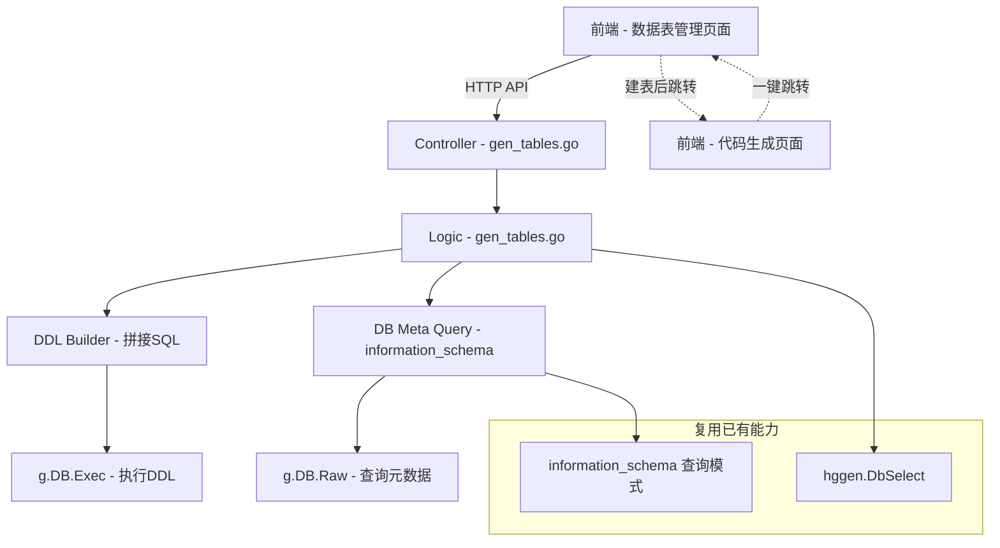

## 产品概述

为 HotGo 后台管理系统的「开发工具」模块新增「数据表管理」功能，实现从可视化设计表结构到建表、再到代码生成的一条龙开发流程。当前代码生成器的前提是数据表必须已存在于数据库中，用户需要手动通过数据库客户端建表。新增此功能后，用户可完全在后台管理界面中完成建表操作，并一键跳转到代码生成配置页面。

## 核心功能

### 数据表列表

- 展示当前数据库中所有表的信息，包括表名、注释、存储引擎、数据行数、创建时间
- 支持切换不同数据库查看
- 每张表提供「查看结构」「编辑结构」「删除表」「一键生成代码」等操作

### 可视化建表

- 表基本信息配置：数据库选择、表名输入（自动添加配置前缀）、表注释、存储引擎选择
- 字段设计区：表格形式逐行设计字段，包含字段名、数据类型、长度、小数位、是否允许空、默认值、注释、主键、自增、无符号等属性
- 预设常用字段模板：一键添加 id 主键自增、created_at/updated_at 时间戳、status 状态、sort 排序等常用字段
- 索引设计区：配置索引名、索引类型（普通/唯一/全文）、索引关联字段

### DDL 预览与执行

- 根据用户配置实时生成 CREATE TABLE DDL 语句
- 预览模式：先展示 SQL 让用户确认后再执行
- 执行建表后返回成功信息

### 修改表结构

- 查看已有表的完整字段和索引信息
- 支持新增字段、修改字段属性、删除字段
- 支持新增/删除索引
- 生成 ALTER TABLE DDL 并执行

### 删除表

- 二次确认后删除指定表
- 禁止删除系统核心表（hg_sys_gen_codes 等配置中的禁用表）

### 与代码生成打通

- 建表成功后提供「一键生成代码」按钮
- 点击后跳转到代码生成配置页面，自动填入数据库和表名信息

## 技术栈

- **后端**: Go + GoFrame v2 框架（与项目现有技术栈一致）
- **前端**: Vue 3 + TypeScript + Naive UI 组件库（与项目现有技术栈一致）
- **数据库**: MySQL（主要支持），兼容 PostgreSQL

## 实现方案

### 策略

完全遵循项目现有的分层架构（API 定义 -> Controller -> Logic -> Model/Input），以现有 `GenCodes`（代码生成）模块为参照蓝本，新增 `GenTables`（数据表管理）模块。后端核心逻辑是根据用户提交的表结构配置拼接标准 DDL SQL 并通过 GoFrame 的 `g.DB()` 执行。前端参照代码生成页面创建新的视图页面，通过后台动态菜单系统注册路由。

### 关键技术决策

1. **复用已有基础设施**：`hggen.DbSelect()` 获取数据库列表、`information_schema` 查询表/字段元数据的模式已在 `gen_codes.go` 中成熟使用，直接复用相同的查询逻辑。

2. **DDL 拼接而非 ORM**：建表/改表属于 DDL 操作，GoFrame ORM 不直接支持 DDL，因此采用字符串拼接 SQL 的方式（参考项目中 `ImportSql` 的 Raw SQL 执行模式），通过 `g.DB().Exec()` 直接执行。

3. **多数据库适配**：参考 `gen_codes.go` 中 `TableSelect`/`ColumnSelect` 方法的 `config.Type` 判断模式，在 DDL 生成时区分 MySQL 和 PostgreSQL 语法。

4. **安全校验**：表名只允许 `[a-zA-Z0-9_]`，自动添加配置中的表前缀（`config.Prefix`），禁用表列表复用 `hggen.disableTables` 配置。删除操作需二次确认。

5. **前端路由**：项目使用后台动态菜单系统（`generatorDynamicRouter` + `import.meta.glob('../views/**/*.{vue,tsx}')`），只需将 Vue 文件放在 `views/develop/table/` 目录下，并通过菜单管理配置路由即可自动发现。

### 性能与可靠性

- DDL 操作为低频操作，不存在性能瓶颈
- 建表前校验表是否已存在，避免冲突报错
- ALTER TABLE 的字段变更逐条生成 DDL 语句，保证部分失败时可以追溯
- DDL 预览模式不执行 SQL，仅返回生成的 DDL 字符串

## 实现要点

1. **复用模式**：Controller 层采用薄控制器模式（参照 `gen_codes.go`），直接调用 Logic 层对应方法。Logic 层中复用 `g.DB(dbName).GetConfig()` 获取数据库配置。

2. **DDL 生成安全**：所有用户输入的表名、字段名需经过正则校验 `^[a-zA-Z_][a-zA-Z0-9_]*，防止 SQL 注入。数据类型使用白名单校验。

3. **表前缀处理**：建表时读取 `g.DB(dbName).GetConfig().Prefix` 自动拼接表前缀；展示时移除前缀（与 `TableSelect` 方法中的逻辑一致）。

4. **不影响现有模块**：新增模块独立文件，仅在 `router/admin.go` 中新增一行 `sys.GenTables` 绑定，零侵入。

## 架构设计

### 系统架构



### 数据流

用户操作 -> 前端表单提交 -> API 请求 -> Controller 转发 -> Logic 校验并生成 DDL -> 执行 SQL -> 返回结果 -> 前端展示

## 目录结构

```
server/
├── api/admin/
│   └── gentables/
│       └── gentables.go              # [NEW] API 请求/响应结构体定义。定义 TableList/TableView/TableCreate/TableEdit/TableDrop/DbSelect/PreviewDDL 共 7 个接口的 Req/Res 结构体，使用 g.Meta 标签定义路由路径和方法。路由前缀统一为 /genTable/。
├── internal/
│   ├── model/input/sysin/
│   │   └── gen_tables.go             # [NEW] 输入/输出模型定义。定义建表字段模型 GenTableColumn（字段名/类型/长度/小数位/是否空/默认值/注释/主键/自增/无符号）、索引模型 GenTableIndex（索引名/类型/关联字段）、建表输入 GenTableCreateInp、改表输入 GenTableEditInp、删表输入 GenTableDropInp、表列表输入输出、表详情输入输出等结构体。
│   ├── logic/sys/
│   │   └── gen_tables.go             # [NEW] 核心业务逻辑层。实现：TableList 查询 information_schema 获取表列表及统计信息；TableView 查询表字段和索引详情；TableCreate 校验+生成 CREATE TABLE DDL+执行；TableEdit 对比差异生成 ALTER TABLE DDL+执行；TableDrop 安全校验+执行 DROP TABLE；PreviewDDL 生成 DDL 但不执行；DbSelect 复用 hggen.DbSelect()；内置 MySQL/PostgreSQL 两种 DDL 方言生成器。
│   ├── controller/admin/sys/
│   │   └── gen_tables.go             # [NEW] 薄控制器层。遵循项目现有 GenCodes 控制器模式，每个方法调用 Logic 层对应方法并组装返回结果。导出 GenTables 变量供路由注册。
│   └── router/
│       └── admin.go                  # [MODIFY] 在 Develop 中间件区域新增 sys.GenTables 路由绑定，与 sys.GenCodes 同级。仅新增一行代码。
web/src/
├── api/develop/
│   └── genTable.ts                   # [NEW] 前端 API 调用层。定义 TableList/TableView/TableCreate/TableEdit/TableDrop/DbSelect/PreviewDDL 共 7 个 HTTP 请求函数，参照 code.ts 的模式使用 http.request。
└── views/develop/table/
    ├── index.vue                     # [NEW] 数据表列表页。展示数据库选择器+表格列表（表名/注释/引擎/行数/创建时间），操作列包含查看结构/编辑/删除/一键生成代码按钮。使用 BasicTable+BasicForm 组件。
    ├── design.vue                    # [NEW] 可视化建表/编辑表页。包含表基本信息区（数据库/表名/注释/引擎）、字段设计区（动态表格行，支持增删排序）、索引设计区、底部操作按钮（预览SQL/执行建表/执行并生成代码）。支持新建和编辑两种模式。
    └── components/
        ├── model.ts                  # [NEW] 前端数据模型。定义字段模型默认值、数据类型选项（varchar/int/bigint/text/json/datetime等）、索引类型选项、引擎选项、预设字段模板（id/created_at/updated_at/status/sort）等常量和工具函数。
        └── PreviewDDL.vue            # [NEW] DDL 预览弹窗组件。使用 n-modal + n-code 组件展示生成的 SQL，提供复制和确认执行按钮。
```

## 关键数据结构

```
// GenTableColumnInp 建表字段配置
type GenTableColumnInp struct {
    Name         string `json:"name"         v:"required|regex:^[a-zA-Z_][a-zA-Z0-9_]*$#字段名不能为空|字段名格式不正确"`
    DataType     string `json:"dataType"     v:"required#数据类型不能为空"` // varchar/int/bigint/tinyint/text/longtext/json/datetime/date/decimal/float/double
    Length       int    `json:"length"`
    Decimal      int    `json:"decimal"`
    IsNullable   bool   `json:"isNullable"`
    DefaultValue string `json:"defaultValue"`
    Comment      string `json:"comment"`
    IsPrimaryKey bool   `json:"isPrimaryKey"`
    IsAutoInc    bool   `json:"isAutoInc"`
    IsUnsigned   bool   `json:"isUnsigned"`
}

// GenTableIndexInp 索引配置
type GenTableIndexInp struct {
    Name    string   `json:"name"`
    Type    string   `json:"type"`    // INDEX/UNIQUE/FULLTEXT
    Columns []string `json:"columns" v:"required#索引字段不能为空"`
}

// GenTableCreateInp 建表请求
type GenTableCreateInp struct {
    DbName    string              `json:"dbName"    v:"required#数据库不能为空"`
    TableName string              `json:"tableName" v:"required|regex:^[a-zA-Z_][a-zA-Z0-9_]*$#表名不能为空|表名格式不正确"`
    Comment   string              `json:"comment"`
    Engine    string              `json:"engine"`   // InnoDB/MyISAM
    Columns   []GenTableColumnInp `json:"columns"   v:"required#字段列表不能为空"`
    Indexes   []GenTableIndexInp  `json:"indexes"`
}
```

## 设计风格

延续 HotGo 后台管理系统现有的 Naive UI 设计体系，保持与代码生成等开发工具页面风格一致。采用功能优先的管理面板风格，清晰的信息层次和高效的操作流程。

## 页面设计

### 页面一：数据表列表页 (index.vue)

**顶部搜索区块**

- 数据库下拉选择器，默认选中 default
- 表名搜索输入框，支持模糊搜索

**操作栏区块**

- 左侧「新建数据表」主操作按钮（primary 蓝色），带加号图标
- 右侧刷新按钮

**表格列表区块**

- 列配置：表名、表注释、存储引擎、数据行数、创建时间
- 表名列使用等宽字体展示，增强可读性
- 操作列：查看结构（默认按钮）、编辑结构（info 按钮）、一键生成代码（success 按钮）、删除（error 文字按钮带确认弹窗）
- 「一键生成代码」按钮跳转到代码生成页面时自动填充数据库和表名

### 页面二：可视化建表/编辑表页 (design.vue)

**顶部面包屑与返回按钮**

- 显示当前操作模式（新建/编辑）与表名

**表基本信息区块**

- 使用 n-card 包裹，标题「基本信息」
- 表单布局：一行四列栅格
- 数据库选择（n-select）
- 表名输入（n-input，带前缀提示如 hg_）
- 表注释输入（n-input）
- 存储引擎选择（n-select，InnoDB/MyISAM）

**字段设计区块**

- 使用 n-card 包裹，标题「字段设计」
- 顶部工具栏：「添加字段」按钮 + 「预设字段」下拉菜单（id主键/时间戳字段/状态字段/排序字段）
- 表格形式展示字段列表，每行可编辑：
- 排序拖拽手柄
- 字段名（n-input）
- 类型（n-select，分组展示：整数类/字符串类/日期类/其他类）
- 长度（n-input-number）
- 小数位（n-input-number，仅 decimal/float/double 时显示）
- 非空（n-checkbox）
- 默认值（n-input）
- 注释（n-input）
- 主键（n-checkbox）
- 自增（n-checkbox）
- 无符号（n-checkbox，仅整数类型时显示）
- 操作列：上移/下移/删除
- 编辑模式下，已有字段标记为灰色底色，新增字段无底色

**索引设计区块**

- 使用 n-card 包裹，标题「索引设计」
- 表格形式：索引名（n-input）、类型（n-select: INDEX/UNIQUE/FULLTEXT）、关联字段（n-select 多选，选项为字段设计区中的字段名）
- 「添加索引」按钮

**底部操作栏**

- 固定在页面底部，白色背景加上阴影
- 按钮组：返回列表（default）、预览 SQL（info）、执行建表/保存修改（success）、执行并生成代码（primary，建表成功后跳转代码生成页）

**DDL 预览弹窗 (PreviewDDL.vue)**

- 全屏宽 80% 的模态框
- 深色背景代码展示区域，SQL 语法高亮
- 底部操作：复制 SQL（default）、关闭（default）、确认执行（success）

## Agent Extensions

### Skill

- **goframe-v2**
- 用途：在实现后端 Logic 层时，参考 GoFrame v2 框架的 ORM 使用规范、请求校验规范、错误处理模式，确保代码符合框架最佳实践
- 预期结果：后端代码完全遵循 GoFrame v2 的 API 定义规范（g.Meta 路由标签）、数据校验规范（v 标签）、错误处理规范（gerror 包装）

### SubAgent

- **code-explorer**
- 用途：在实现各步骤时，探索相关文件的具体代码细节，确保新代码与现有模式一致
- 预期结果：准确获取需要参照的代码结构和导入路径，避免路径错误或风格不一致