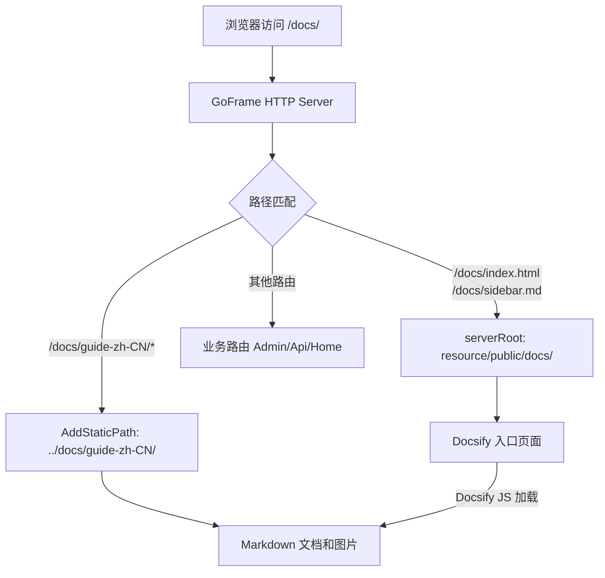

## 用户需求

将 HotGo 项目的 Docsify 文档内置到 Server 中，随 Server 启动时自动提供 HTTP 静态文件服务，用户启动 Server 后即可通过浏览器访问文档，无需额外安装 docsify-cli 或启动独立的静态文件服务器。

## 产品概述

在 HotGo Server 的 HTTP 服务中集成文档站点，通过 `/docs/` 路径即可访问完整的 Docsify 文档，包含侧边栏导航、搜索、代码高亮、Mermaid 图表等功能。

## 核心功能

- Server 启动后，访问 `http://localhost:8000/docs/` 即可查看完整的项目开发文档
- 文档站点包含侧边栏导航，支持搜索、代码高亮、暗色模式切换等 Docsify 原有功能
- 仅在非生产模式（develop/testing/staging）下启用文档服务，生产环境不暴露文档
- 不移动或复制原有文档文件，直接引用项目根目录下的 `docs/` 目录

## 技术栈

- 后端框架：GoFrame v2（项目已有）
- 文档引擎：Docsify v4（项目已有，CDN 引用）
- 静态文件服务：GoFrame `ghttp.Server.AddStaticPath()`

## 实现方案

### 整体策略

在 `server/internal/cmd/http.go` 中，利用 GoFrame 的 `AddStaticPath()` 方法将文档目录映射到 `/docs/` HTTP 路径下。同时在 `server/resource/public/docs/` 下创建适配 `/docs/` 基础路径的 Docsify 入口文件（`index.html` 和 `sidebar.md`），使 Docsify 能正确加载侧边栏和所有 Markdown 文件。

### 关键技术决策

1. **使用 `AddStaticPath` 而非复制文件**：直接映射 `../docs` 目录到 `/docs/guide-zh-CN` 路径，避免文件冗余和同步问题。这与项目中插件模块 `addons.AddStaticPath()` 的做法一致。

2. **在 `resource/public/docs/` 下创建 Docsify 入口文件**：由于 `serverRoot` 已配置为 `resource/public`，放在 `resource/public/docs/` 下的 `index.html` 会自动被 GoFrame 静态文件服务提供，访问路径为 `/docs/`。这样只需一个 `AddStaticPath` 调用来映射 Markdown 源文件目录。

3. **仅非生产模式启用**：通过 `gmode.IsProduct()` 判断，与项目中 `hggen.InIt(ctx)` 的保护方式一致，避免生产环境暴露文档。

4. **路径适配**：

- 原 `sidebar.md` 中链接格式为 `/docs/guide-zh-CN/xxx.md`（绝对路径），在新入口中改为相对路径 `guide-zh-CN/xxx.md`，配合 Docsify 的 `relativePath: true` 和 `basePath` 配置
- 原 `nameLink` 从 `/hotgo/` 改为 `/docs/`
- 原 `系统介绍` 链接 `../../README.md` 改为指向 `/docs/README.md`，并通过 `AddStaticPath` 映射根目录 README.md

### 静态路径映射关系

| HTTP 路径 | 文件系统路径 | 说明 |
| --- | --- | --- |
| `/docs/` | `resource/public/docs/` (serverRoot) | Docsify 入口 index.html、sidebar.md |
| `/docs/guide-zh-CN/` | `../docs/guide-zh-CN/` | Markdown 文档及图片 |
| `/docs/README.md` | `../README.md` | 项目首页 README（通过路由处理） |


## 实现细节

### 路径处理注意事项

- Server 的工作目录是 `server/`，因此 `../docs` 指向项目根目录下的 `docs/`
- 使用 `gfile.RealPath` 或相对路径 `../docs/guide-zh-CN` 作为 `AddStaticPath` 的文件系统路径
- `README.md` 在项目根目录，需要单独处理：可以在 `resource/public/docs/` 下放一份指向根 README 的 sidebar 链接，或用路由重定向

### 兼容性保障

- 不修改原始的 `index.html`、`sidebar.md`、`README.md`，保持原有 Docsify 独立部署能力
- 新建的 `resource/public/docs/index.html` 和 `resource/public/docs/sidebar.md` 是独立副本，专为嵌入 Server 适配
- 非生产模式判断确保生产环境安全

### 性能考量

- 静态文件服务由 GoFrame 内置高性能 HTTP Server 处理，无额外开销
- 所有 JS/CSS 资源通过 CDN 加载，Server 仅提供 Markdown 文件和少量 HTML

## 架构设计



## 目录结构

```
server/
├── internal/
│   └── cmd/
│       └── http.go                          # [MODIFY] 添加文档静态路径映射，非生产模式下注册 /docs/guide-zh-CN 的 AddStaticPath，并添加 /docs/README.md 的路由处理
├── resource/
│   └── public/
│       └── docs/
│           ├── index.html                   # [NEW] Docsify 入口文件，基于项目根目录的 index.html 适配 /docs/ 基础路径，修改 basePath、nameLink、loadSidebar 等配置
│           └── sidebar.md                   # [NEW] 侧边栏导航文件，基于项目根目录的 sidebar.md 将链接路径从 /docs/guide-zh-CN/xxx.md 改为 guide-zh-CN/xxx.md 相对路径
```

## Agent Extensions

### Skill

- **goframe-v2**
- 用途：参考 GoFrame v2 框架的 `ghttp.Server.AddStaticPath` API 用法、静态文件服务配置、路由注册等最佳实践
- 预期结果：确保 AddStaticPath 和静态文件路由的写法符合 GoFrame v2 规范，正确配置路径映射

### SubAgent

- **code-explorer**
- 用途：如需进一步探索 GoFrame Server 静态文件服务的具体行为或项目中其他类似用法
- 预期结果：获取准确的代码上下文，确保实现方案与现有项目模式一致