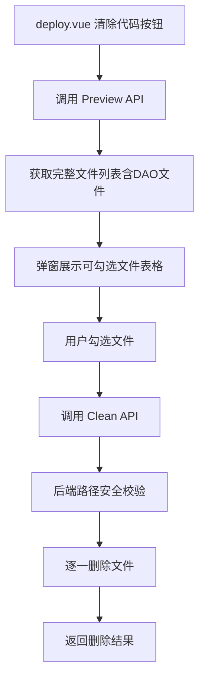

## 用户需求

在代码生成部署页面增加"一键清除生成代码"功能，允许用户查看当前生成配置所对应的所有文件列表，并可勾选删除。

## 产品概述

在 HotGo 代码生成工具的部署页面（deploy.vue）中新增"清除代码"按钮，点击后系统通过 Preview 接口获取当前生成配置所生成的全部文件路径列表（包含后端 api.go、input.go、controller.go、logic.go、router.go、source.sql 及前端 api.ts、model.ts、index.vue、edit.vue、view.vue，以及 DAO 相关的 dao、dao/internal、model/do、model/entity 文件），以弹窗列表形式展示。列表中显示文件路径、文件是否存在等信息，用户可勾选需要删除的文件，确认后调用后端新增的 Clean 接口执行文件删除。

## 核心功能

- 部署页面新增"清除代码"按钮，位于现有操作按钮行中
- 点击按钮后，调用 Preview 获取文件列表，同时补充 DAO 相关文件（dao、dao/internal、model/do、model/entity）
- 弹窗中以可勾选表格形式展示所有生成文件，包含文件名、路径、是否存在状态
- 用户可全选/取消全选，勾选后确认调用后端 Clean API 删除选中文件
- 后端 Clean API 接收文件路径列表，校验路径安全性后执行删除，返回删除结果

## 技术栈

- **后端**: Go + GoFrame v2 框架，遵循现有 HotGo 项目架构（API -> Controller -> Logic 三层）
- **前端**: Vue 3 + TypeScript + Naive UI 组件库，遵循现有项目前端约定

## 实现方案

### 总体策略

后端新增 Clean API，接收生成配置 ID 和待删除文件路径列表。通过复用现有 Preview 逻辑获取文件路径，并补充 DAO 相关文件路径，前端在弹窗中展示带勾选的文件表格，确认后调用 Clean API 批量删除。

### 关键技术决策

1. **复用 Preview 获取文件列表**：前端先调用已有的 Preview 接口获取生成文件的路径信息（views map），再补充 DAO 相关的 4 个文件路径（dao、dao/internal、model/do、model/entity），避免后端重复实现文件路径计算逻辑。

2. **Clean API 设计为纯文件路径删除接口**：接收 `[]string` 类型的文件路径列表，后端只负责校验路径安全性和执行删除。路径安全性校验包括：路径必须在项目根目录下（`gfile.Pwd()` 范围内），防止路径穿越攻击；路径不能包含 `..` 等危险字符。

3. **DAO 文件路径计算**：根据 `daoName`（表名去前缀后的 snake_case 名称）和 `defaultGenDaoInput` 中的 `DaoPath`、`DoPath`、`EntityPath` 配置，在后端 Preview 返回结果中追加 DAO 相关文件信息。或者更简单的方式：在后端新增一个获取清除文件列表的接口，该接口内部调用 Preview 后再追加 DAO 文件。

4. **选择在后端整合完整文件列表**：新增 `CleanList` 或将清理文件列表逻辑整合到后端，避免前端硬编码路径拼接逻辑。后端在 Preview 基础上追加 DAO 文件路径，返回统一的文件列表。

### 性能与可靠性

- 文件删除操作为 O(n) 线性，n 为选中文件数量，通常不超过 15 个
- 每次删除前检查文件是否存在，不存在则跳过
- 删除操作使用 `gfile.Remove` 而非 `gfile.RemoveAll`，避免误删目录

## 实现细节

### 后端实现

1. **新增 API 定义** (`server/api/admin/gencodes/gencodes.go`)：

- `CleanReq`：接收 `sysin.GenCodesCleanInp`，路径 `/genCodes/clean`，方法 POST
- `CleanRes`：返回清理结果

2. **新增 Input 模型** (`server/internal/model/input/sysin/gen_codes.go`)：

- `GenCodesCleanInp`：包含 `Id int64` 和 `Files []string`（待删除文件路径列表）
- `GenCodesCleanModel`：返回删除成功数量和失败信息

3. **新增 Controller 方法** (`server/internal/controller/admin/sys/gen_codes.go`)：

- `Clean` 方法，调用 logic 层

4. **新增 Logic 方法** (`server/internal/logic/sys/gen_codes.go`)：

- `Clean` 方法：校验文件路径安全性（必须在项目工作目录下，不含 `..`），逐一删除文件
- 路径安全校验：使用 `gfile.Abs()` 将路径转为绝对路径后检查是否以 `gfile.Pwd()` 开头

5. **扩展 Preview 返回数据**：在 `hggen.Preview` 或 `gen_codes.go` 的 Preview logic 中，追加 DAO 相关文件（dao/xxx.go, dao/internal/xxx.go, model/do/xxx.go, model/entity/xxx.go）到 Views map 中，使前端可直接获取完整文件列表。这些文件的 key 命名为 `dao.go`、`dao.internal.go`、`do.go`、`entity.go`。

### 前端实现

1. **新增 API 函数** (`web/src/api/develop/code.ts`)：

- `Clean` 函数：POST `/genCodes/clean`

2. **部署页面新增功能** (`web/src/views/develop/code/deploy.vue`)：

- 新增"清除代码"按钮（红色/warning 风格），放在按钮区域
- 点击后调用 Preview 获取文件列表
- 弹窗展示 `n-data-table`（带 checkbox 选择列），列：文件名(key)、文件路径(path)、是否存在（根据 meth 判断：meth=3/skip 表示已存在，meth=1/create 表示不存在）
- 默认勾选所有已存在的文件
- 确认按钮调用 Clean API

## 架构设计



### 数据流

1. 用户点击"清除代码" -> 前端调用 Preview API
2. 后端 Preview 返回 views map（含 DAO 文件） -> 前端解析为文件列表
3. 用户勾选 -> 前端提交路径列表到 Clean API
4. 后端校验路径安全 -> 删除文件 -> 返回结果

## 目录结构

```
server/
├── api/admin/gencodes/
│   └── gencodes.go              # [MODIFY] 新增 CleanReq/CleanRes API 定义
├── internal/
│   ├── controller/admin/sys/
│   │   └── gen_codes.go         # [MODIFY] 新增 Clean 控制器方法
│   ├── logic/sys/
│   │   └── gen_codes.go         # [MODIFY] 新增 Clean 业务逻辑方法，修改 Preview 追加 DAO 文件
│   ├── model/input/sysin/
│   │   └── gen_codes.go         # [MODIFY] 新增 GenCodesCleanInp/GenCodesCleanModel 结构体
│   └── library/hggen/
│       └── hggen.go             # [MODIFY] 新增 GetDaoFiles 方法，根据生成配置返回 DAO 相关文件路径列表
web/
├── src/
│   ├── api/develop/
│   │   └── code.ts              # [MODIFY] 新增 Clean API 调用函数
│   └── views/develop/code/
│       └── deploy.vue           # [MODIFY] 新增"清除代码"按钮、清除弹窗（含勾选文件表格）、清除逻辑
```

## 关键代码结构

```
// GenCodesCleanInp 清除生成代码
type GenCodesCleanInp struct {
    Id    int64    `json:"id" v:"required#生成代码ID不能为空" dc:"生成代码ID"`
    Files []string `json:"files" v:"required#文件列表不能为空" dc:"待删除文件路径列表"`
}

type GenCodesCleanModel struct {
    Count   int      `json:"count" dc:"成功删除文件数"`
    Failed  []string `json:"failed" dc:"删除失败的文件"`
}
```

## Agent Extensions

### Skill

- **goframe-v2**
- 用途：在实现后端 Clean API 时参考 GoFrame v2 框架的路由注册、请求/响应结构体定义、参数校验等最佳实践
- 预期效果：确保新增 API 的定义方式、校验规则、错误处理完全遵循 GoFrame v2 规范

### SubAgent

- **code-explorer**
- 用途：在实现过程中需要查找更多相关代码模式（如其他 API 的完整实现链路、NaiveUI 组件用法参考等）
- 预期效果：快速定位项目中类似功能的实现模式以确保一致性