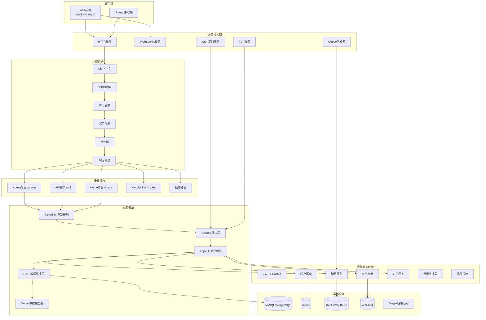
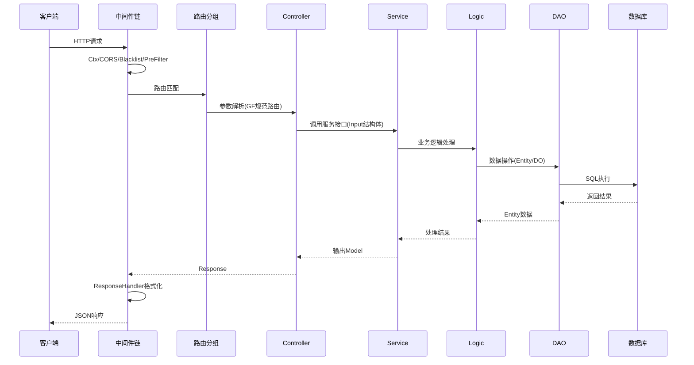

## 用户需求

深入分析 HotGo 项目的代码库结构、核心功能模块、技术架构及依赖关系，梳理业务逻辑和数据流向，生成一份详尽的开发文档。

## 产品概述

为 HotGo V2（v2.18.6）全栈开发框架生成一份完整的开发文档，文档需涵盖项目概述、目录结构说明、技术架构解析、核心模块详解（服务端与前端）、关键组件接口定义、配置参数详情、数据流向说明、插件系统机制以及部署指南。文档面向团队协作和后续维护场景，要求条理清晰、技术细节准确。

## 核心内容

1. **项目概述**：版本信息、技术栈、功能特性总览
2. **目录结构说明**：服务端（server/）和前端（web/）的完整目录结构及各层职责
3. **技术架构解析**：多服务命令入口、中间件链、路由分组、鉴权流程、数据流向
4. **服务端核心模块详解**：cmd命令层、controller控制器层、logic业务层、model数据层、library功能库、service接口层、dao数据访问层、插件系统
5. **前端核心模块详解**：入口启动流程、路由守卫、状态管理（Pinia）、API调用层、页面视图组件
6. **关键组件接口定义**：服务接口（service层）、消息队列接口、插件模块接口、中间件接口
7. **配置参数详情**：系统配置、数据库配置、缓存配置、队列配置、JWT令牌配置、路由配置、代码生成配置
8. **部署指南**：环境要求、安装步骤、编译构建、Docker部署、Kubernetes部署、Nginx配置

## 技术栈

本项目为文档生成任务，不涉及代码实现。文档以 Markdown 格式编写，存放于项目 `docs/` 目录下。

### 项目技术栈梳理

- **后端**：Go 1.24 + GoFrame v2.9.4
- **前端**：Vue 3.4 + TypeScript 5.5 + Naive UI 2.43+ + Vite 5.4 + Pinia
- **数据库**：MySQL 5.7+ / PostgreSQL 14+
- **缓存**：Redis / File / Memory
- **消息队列**：Disk / Redis / RocketMQ / Kafka
- **对象存储**：本地 / 阿里云OSS / 腾讯云COS / UCloud / 七牛云 / MinIO
- **认证**：JWT v5 + Casbin RBAC
- **实时通信**：gorilla/websocket + 自研TCP服务
- **链路追踪**：Jaeger
- **部署**：Docker + Kubernetes (Kustomize)

## 实现方案

采用结构化 Markdown 文档方式，按模块拆分章节，每个文档独立一个主题。文档内容基于实际代码文件和现有 `docs/guide-zh-CN/` 目录下的文档进行深度补充和体系化整理。

### 关键技术决策

1. **文档组织方式**：新建一份主文档 `docs/guide-zh-CN/dev-guide.md` 作为完整开发文档的入口，同时对已有文档中缺失的内容进行补充
2. **架构图使用 Mermaid**：在文档中使用 Mermaid 语法绘制架构图和流程图，便于版本管理和协作
3. **基于代码验证**：所有技术细节均基于实际代码文件验证，确保准确性

## 实现细节

### 服务端架构分析要点

**启动流程**：

- `main.go` -> `global.Init()` (设置运行模式/时区/日志/链路追踪/缓存/配置/超管/集群同步) -> `cmd.Main.Run()` -> `All` 命令默认启动 HTTP + Queue + Cron 三个服务

**多服务命令体系**：

- `all`(默认): 启动所有服务
- `http`: HTTP/WebSocket/TCP 服务，含中间件链 Ctx -> CORS -> Blacklist -> DemoLimit -> PreFilter -> ResponseHandler
- `queue`: 消息队列消费者，通过 `queue.StartConsumersListener` 启动
- `cron`: 定时任务，通过 TCP 客户端与后台保持通讯
- `auth/tools/up/help`: 辅助命令

**路由体系**：

- Admin 后台 `/admin`：common.Site(免登录) + 系统管理/用户管理/支付管理(AdminAuth 中间件) + 开发工具(Develop 中间件)
- API 接口 `/api`：pay(免登录) + member(ApiAuth 中间件)
- WebSocket `/socket`
- Home 前台 `/home`

**鉴权流程** (AdminAuth)：

1. 检查是否为免登录路由 -> 放行
2. DeliverUserContext 将用户信息写入上下文
3. 检查是否为免权限路由 -> 放行
4. Casbin 验证路由访问权限 -> 放行/拒绝

**分层架构**：api (输入输出定义) -> controller (参数解析) -> service (接口定义) -> logic (业务实现) -> dao (数据访问) -> model (数据模型)

**插件系统**：

- 微核架构，每个插件实现 `addons.Module` 接口（Start/Stop/Install/Upgrade/UnInstall/GetSkeleton/Ctx）
- 通过 `addons/modules` 包隐式注入，在 `main.go` 中 import
- 每个插件拥有独立的 api/controller/crons/global/logic/model/queues/router/service 目录

**消息队列**：

- 实现 Consumer 接口（GetTopic + Handle），通过 `queue.RegisterConsumer` 注册
- 生产者通过 `queue.Push` 发送消息

### 前端架构分析要点

**启动流程**：
`main.ts` -> i18n -> setupNaive -> setupDirectives -> setupStore(Pinia) -> setupRouter -> createRouterGuards -> setupWebsocket -> mount

**路由系统**：Hash 路由模式 + 动态路由（通过服务端 `/role/dynamic` 接口获取）

**状态管理**（Pinia stores）：user, asyncRoute, dict, designSetting, i18n, lockscreen, notification, projectSetting, tabsView

**API 层**：22 个模块对应后端接口，基于 axios 封装

## 架构设计

### 系统架构图



### 数据流向图



## 目录结构

以下为需要新建的开发文档文件：

```
docs/guide-zh-CN/
├── dev-guide.md                  # [NEW] 完整开发文档主入口。包含项目概述、技术栈说明、版本信息，以及各章节的导航索引。作为整份开发文档的总览页面。
├── dev-architecture.md           # [NEW] 技术架构深度解析文档。包含系统架构图(Mermaid)、多服务命令体系、启动初始化流程、中间件链详解、路由分组机制、鉴权流程、数据流向图、分层架构说明。
├── dev-server-modules.md         # [NEW] 服务端核心模块详解。涵盖cmd命令层(8个命令)、controller控制器层(4个应用入口)、logic业务逻辑层(6个子包)、model数据模型层(entity/do/input)、service接口层、dao数据访问层(41个DAO)、library功能库(22个模块)、utility工具包(12个子包)。每个模块需说明职责、关键文件、接口定义。
├── dev-frontend-modules.md       # [NEW] 前端核心模块详解。涵盖入口启动流程(main.ts)、路由系统(Hash路由+动态路由+守卫)、状态管理(Pinia 10个store)、API调用层(22个模块)、页面视图(20个模块)、组件体系、hooks、指令系统、国际化。
├── dev-plugin-system.md          # [NEW] 插件系统完整指南。包含插件微核架构设计思想、Module接口定义(Start/Stop/Install/Upgrade/UnInstall/GetSkeleton/Ctx)、Skeleton配置结构、插件目录结构规范、启动加载流程、路由注册机制、与主系统的交互方式、hgexample示例插件分析。
├── dev-config-reference.md       # [NEW] 配置参数完整参考手册。涵盖config.yaml所有配置项的详细说明：system系统配置、server HTTP服务配置、tcp服务配置、logger日志配置、viewer模板配置、router路由配置、cache缓存配置、token令牌配置、queue消息队列配置、redis配置、database数据库配置、jaeger链路追踪配置、hggen代码生成配置。每项需标注类型、默认值、可选值、作用说明。
├── dev-api-interfaces.md         # [NEW] 关键组件接口定义文档。包含service层核心接口(ISysConfig/IAdminMember/IAdminRole等)、消息队列Consumer接口、插件Module接口、中间件接口、支付网关接口、存储驱动接口、缓存适配器接口。需列出方法签名和功能说明。
└── dev-deployment.md             # [NEW] 部署指南。涵盖环境要求(Node>=20/Go>=1.23/MySQL>=5.7)、安装步骤、编译构建(make build/手动/分端)、生产配置修改要点、Docker部署(Dockerfile解析)、Kubernetes部署(Kustomize)、Nginx反向代理配置(HTTP+WebSocket)、集群部署说明(Redis Pub/Sub)。
```

## Agent Extensions

### SubAgent

- **code-explorer**
- 用途：在编写各文档章节时，对特定模块进行深度代码探索，确保文档中的接口签名、文件路径、函数调用关系等技术细节与代码库完全一致
- 预期结果：获取准确的接口定义、函数签名、模块依赖关系，用于填充文档中的技术细节