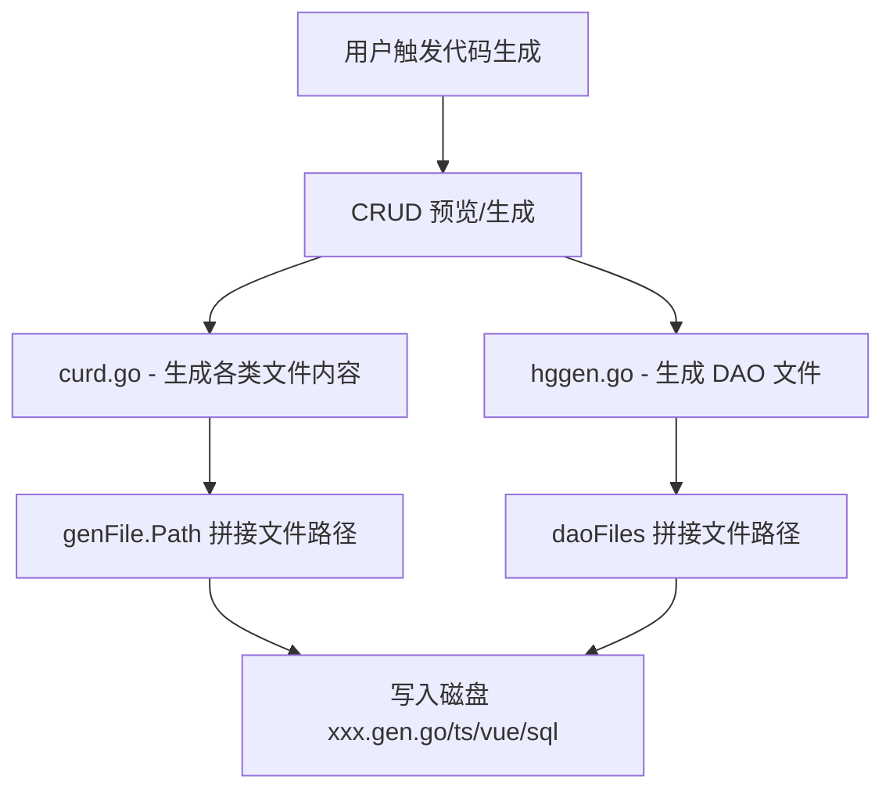

## 用户需求

将 HotGo 代码生成器生成的所有文件的文件名规则进行修改，在文件扩展名前增加 `.gen.` 标识，用于区分自动生成的文件和手动编写的文件。

## 产品概述

HotGo 项目内置了 CRUD 代码生成器，能够根据数据库表结构自动生成 Go 后端代码（API、Input、Controller、Logic、Router、DAO）、前端 Vue/TS 代码（API、Model、Index、Edit、View）以及 SQL 菜单文件。当前生成的文件使用标准扩展名，与手写文件无法直观区分。本次修改将所有生成文件统一加上 `.gen.` 标识。

## 核心功能

- Go 文件命名规则：`xxx.go` 改为 `xxx.gen.go`（涵盖 API、Input、Controller、Logic、Router、DAO 等所有 Go 生成文件）
- TypeScript 文件命名规则：`index.ts` 改为 `index.gen.ts`，`model.ts` 改为 `model.gen.ts`
- Vue 文件命名规则：`index.vue` 改为 `index.gen.vue`，`edit.vue` 改为 `edit.gen.vue`，`view.vue` 改为 `view.gen.vue`
- SQL 文件命名规则：`xxx_menu.sql` 改为 `xxx_menu.gen.sql`

## 技术栈

- 后端框架：GoFrame v2（Go 语言）
- 代码生成引擎：HotGo 内置的 hggen 库

## 实现方案

### 策略概述

在代码生成器的文件路径拼接处，将原来的文件扩展名（如 `.go`、`.ts`、`.vue`、`.sql`）统一替换为带 `.gen.` 前缀的扩展名（如 `.gen.go`、`.gen.ts`、`.gen.vue`、`.gen.sql`）。修改集中在两个文件中，均为简单的字符串替换。

### 关键技术决策

1. **仅修改文件名生成逻辑**：不修改模板内容、不修改路由路径、不修改清理逻辑（Clean 方法基于绝对路径操作，无需改动）
2. **pageRedirect 路径不受影响**：SQL 模板中的 `pageRedirect` 引用的是路由路径 `/index`，非文件名，无需修改
3. **DAO 文件同步修改**：`hggen.go` 中的 `AppendDaoFiles` 函数生成的 4 个 DAO 相关文件也需要同步修改

## 实现细节

### 注意事项

- 修改仅涉及字符串拼接处的扩展名部分，不改变目录结构和文件路径逻辑
- `genFile.Path` 中的文件名是最终写入磁盘的路径，修改后新生成的文件将使用 `.gen.` 命名
- `in.content.Views[name]` 的 key（如 `"api.go"`、`"web.api.ts"` 等）是内部视图标识符，不是文件名，无需修改
- Clean 方法 (`gen_codes.go` 第361行) 接收的是完整绝对路径列表进行删除，不依赖文件名模式匹配，因此无需修改

## 架构设计

代码生成器的文件名生成流程：



## 目录结构

```
server/internal/library/hggen/
├── views/
│   └── curd.go              # [MODIFY] CRUD 代码生成核心文件。修改 11 处文件名拼接逻辑，将 ".go"/".ts"/".vue"/".sql" 替换为 ".gen.go"/".gen.ts"/".gen.vue"/".gen.sql"
└── hggen.go                 # [MODIFY] DAO 文件生成逻辑。修改 AppendDaoFiles 函数中 4 处 DAO 文件名拼接，将 ".go" 替换为 ".gen.go"
```

### 修改对照表

| 文件 | 行号 | 修改前 | 修改后 |
| --- | --- | --- | --- |
| curd.go | 582 | `strings.ToLower(in.In.VarName)+".go"` | `strings.ToLower(in.In.VarName)+".gen.go"` |
| curd.go | 619 | `convert.CamelCaseToUnderline(in.In.VarName)+".go"` | `convert.CamelCaseToUnderline(in.In.VarName)+".gen.go"` |
| curd.go | 651 | `convert.CamelCaseToUnderline(in.In.VarName)+".go"` | `convert.CamelCaseToUnderline(in.In.VarName)+".gen.go"` |
| curd.go | 687 | `convert.CamelCaseToUnderline(in.In.VarName)+".go"` | `convert.CamelCaseToUnderline(in.In.VarName)+".gen.go"` |
| curd.go | 718 | `convert.CamelCaseToUnderline(in.In.VarName)+".go"` | `convert.CamelCaseToUnderline(in.In.VarName)+".gen.go"` |
| curd.go | 746 | `"index.ts"` | `"index.gen.ts"` |
| curd.go | 779 | `"model.ts"` | `"model.gen.ts"` |
| curd.go | 811 | `"index.vue"` | `"index.gen.vue"` |
| curd.go | 843 | `"edit.vue"` | `"edit.gen.vue"` |
| curd.go | 880 | `"view.vue"` | `"view.gen.vue"` |
| curd.go | 957 | `+"_menu.sql"` | `+"_menu.gen.sql"` |
| hggen.go | 316 | `fileName+".go"` (dao) | `fileName+".gen.go"` |
| hggen.go | 317 | `fileName+".go"` (dao/internal) | `fileName+".gen.go"` |
| hggen.go | 318 | `fileName+".go"` (do) | `fileName+".gen.go"` |
| hggen.go | 319 | `fileName+".go"` (entity) | `fileName+".gen.go"` |


## Agent Extensions

### Skill

- **goframe-v2**
- 用途：确保修改符合 GoFrame v2 框架的代码规范和最佳实践
- 预期效果：修改后的代码生成逻辑与 GoFrame 框架保持一致