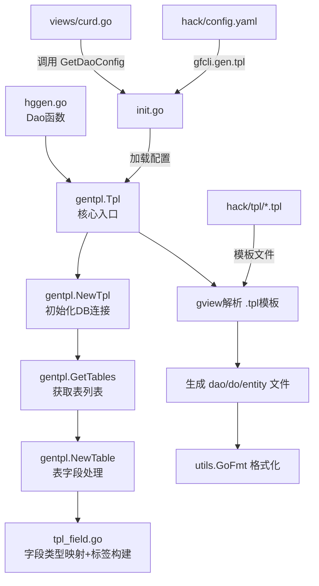

## 产品概述

将 HotGo 项目中现有的 `gen dao`（基于硬编码 Go 模板字符串）代码生成机制，替换为 `gen tpl`（基于自定义 `.tpl` 模板文件的灵活代码生成）方式，使 DAO/DO/Entity 的生成逻辑由外部模板文件驱动，便于用户自定义和维护。

## 核心功能

1. **引入 gen tpl 核心模块**：在 `hggen/internal/cmd/` 下新增 `gentpl/` 包，包含 `tpl.go`（入口与配置）、`tpl_table.go`（表处理）、`tpl_field.go`（字段处理与标签构建）三个核心文件
2. **创建 HotGo 专用 .tpl 模板文件**：在 `server/hack/tpl/` 目录下创建 dao index、dao internal、do、entity 四套 `.tpl` 模板，生成结果与当前 gen dao 输出完全一致
3. **修改配置加载**：`init.go` 支持读取 `gfcli.gen.tpl` 配置节点（数组格式，兼容多数据库分组），新增 `tplPath`、`jsonOmitemptyAuto`、`withOrmTag` 等配置项
4. **替换 Dao() 函数**：`hggen.go` 中的 `Dao()` 函数改为调用 gen tpl 模块，移除对 `gendao.doGenDaoForArray` 的 `go:linkname` 依赖
5. **适配下游依赖**：`views/curd.go` 和 `views/column.go` 中的 `gendao.CGenDaoInput` 类型引用切换为新的 `gentpl.CGenTplInput`
6. **更新配置文件**：`hack/config.yaml` 从 `gfcli.gen.dao` 格式迁移到 `gfcli.gen.tpl` 格式

## 技术栈

- 语言：Go 1.24（与当前项目一致）
- 框架：GoFrame v2.9.4（`github.com/gogf/gf/v2`）
- 模板引擎：`gview`（GoFrame 内置模板引擎，gen tpl 核心依赖）
- 数据库驱动：MySQL / PostgreSQL（与当前一致）
- 无需新增外部依赖

## 实现方案

### 整体策略

在 `hggen/internal/cmd/` 下新建 `gentpl/` 包，从 PR #1 的 `tpl.go`/`tpl_table.go`/`tpl_field.go` 移植核心逻辑，适配 HotGo 的项目结构和 import 路径。通过外部 `.tpl` 模板文件替代 `consts/` 中的硬编码模板字符串，使用 `gview` 解析模板并生成文件。

### 关键技术决策

1. **保留 gendao 包不删除，新增 gentpl 包并行**：避免破坏现有代码和依赖。初期将 `CGenDaoInput` 作为 `CGenTplInput` 的内嵌字段，保持向下兼容。外部调用处（`views/curd.go`、`views/column.go`）的类型参数逐步迁移。

2. **CGenTplInput 设计**：内嵌 `gendao.CGenDaoInput` 并扩展 `TplPath`、`JsonOmitempty`、`JsonOmitemptyAuto`、`WithOrmTag` 等新字段，保证已有配置项无缝传递。

3. **模板文件驱动**：将当前 `consts` 中的 4 套硬编码模板（dao index、dao internal、do、entity）转换为 `.tpl` 文件放置在 `server/hack/tpl/` 下。模板变量使用 `gview` 的 `{{.xxx}}` 语法，字段级操作通过 `TableField` 结构体方法（如 `BuildTags`）在模板中直接调用。

4. **Dao() 函数重构**：移除 `go:linkname` hack，改为直接调用 `gentpl.Tpl(ctx, input)` 方法。保留临时路径生成策略（减少热编译触发）。

5. **配置兼容策略**：`init.go` 的 `loadConfig` 同时检查 `gfcli.gen.tpl` 和 `gfcli.gen.dao`，优先使用 `tpl`，回退到 `dao`。这样存量用户不修改配置也能工作。

## 实现备忘

- **go:linkname 移除**：`hggen.go` 中的 `//go:linkname doGenDaoForArray` 和 `import _ "unsafe"` 必须同步移除，否则编译报错。
- **模板文件路径**：`TplPath` 默认值设为 `hack/tpl`，使用 `gfile.Search` 从项目根目录查找。
- **gofmt 保留**：gen tpl 生成后需调用现有的 `utils.GoFmt(path)` 保持代码格式一致。
- **gendao 清理逻辑复用**：gen tpl 需要实现等价的文件清理逻辑（追踪生成的文件路径，清理多余文件）。
- **views/column.go 适配**：`DoTableColumns`、`GenGotype` 等函数签名中的 `gendao.CGenDaoInput` 改为接受 `gentpl.CGenTplInput`，内部逻辑不变（字段如 `JsonCase`、`StdTime`、`GJsonSupport` 均可从新类型获取）。
- **向后兼容**：`GetDaoConfig` 函数保留但返回类型改为 `gentpl.CGenTplInput`，原有调用处自动适配。

## 架构设计

### 模块关系



### 数据流

1. `init.go` 从 `hack/config.yaml` 读取 `gfcli.gen.tpl` 配置数组（兼容读取 `gfcli.gen.dao`）
2. `Dao()` 函数遍历配置数组，为每个分组构建 `CGenTplInput`，调用 `gentpl.Tpl()`
3. `gentpl.Tpl()` 连接数据库 -> 获取表列表 -> 遍历 `hack/tpl/` 下的所有 `.tpl` 文件 -> 逐表逐模板解析生成
4. 生成文件先写入临时路径，再拷贝回项目目录

## 目录结构

```
server/
├── hack/
│   ├── config.yaml                     # [MODIFY] gfcli.gen.dao 配置节点改为 gfcli.gen.tpl，新增 tplPath/withOrmTag/jsonOmitemptyAuto 等字段
│   └── tpl/                            # [NEW] 模板文件目录
│       ├── dao/
│       │   └── dao.tpl                 # [NEW] DAO index 模板。生成 dao 包的对外入口文件，包含 xxxDao 结构体定义和全局变量。需产出与当前 consts.TemplateGenDaoIndexContent 完全一致的结果
│       ├── dao_internal/
│       │   └── dao_internal.tpl        # [NEW] DAO internal 模板。生成 internal 包的核心 DAO 实现，包含列定义、列名映射、CRUD 方法。需产出与当前 consts.TemplateGenDaoInternalContent 一致的结果
│       ├── model_do/
│       │   └── do.tpl                  # [NEW] DO 模板。生成 model/do 包的 Data Object 结构体，所有非指针类型替换为 any。需产出与当前 consts.TemplateGenDaoDoContent 一致的结果
│       └── model_entity/
│           └── entity.tpl              # [NEW] Entity 模板。生成 model/entity 包的实体结构体，包含完整的 json/orm/description 标签。需产出与当前 consts.TemplateGenDaoEntityContent 一致的结果
├── internal/
│   └── library/
│       └── hggen/
│           ├── init.go                 # [MODIFY] 新增 tplConfig 变量和 defaultGenTplInput 默认值；loadConfig 支持读取 gfcli.gen.tpl 配置（兼容 gfcli.gen.dao 回退）；GetDaoConfig 返回类型改为 gentpl.CGenTplInput
│           ├── hggen.go                # [MODIFY] 移除 go:linkname 和 unsafe 导入；Dao() 函数改为调用 gentpl 包的 Tpl 方法；保留临时路径拷贝策略
│           ├── internal/
│           │   └── cmd/
│           │       └── gentpl/                 # [NEW] gen tpl 核心包
│           │           ├── gentpl.go           # [NEW] 核心入口。定义 CGenTplInput 结构体（内嵌 CGenDaoInput + 扩展字段）、Tpl() 主函数（扫描模板→遍历表→gview解析→写文件→gofmt）、NewTpl() 初始化、GetDB() 数据库连接
│           │           ├── gentpl_table.go     # [NEW] 表处理。定义 Table 结构体（Name/OutputName/Fields/Imports）、NewTable() 获取表字段并转换、GetTables() 获取所有表并过滤、TableOutputName() 处理前缀移除
│           │           └── gentpl_field.go     # [NEW] 字段处理。定义 TableField 结构体（扩展 gdb.TableField + LocalType/JsonTag/CustomTags）、GetLocalTypeName() 类型映射、BuildTags() 构建标签字符串（json/orm/description + 自定义）
│           └── views/
│               ├── curd.go             # [MODIFY] CurdPreviewInput.DaoConfig 类型从 gendao.CGenDaoInput 改为 gentpl.CGenTplInput；DoBuild 中数据库连接配置适配
│               └── column.go           # [MODIFY] DoTableColumns/CustomLinkAttributes/CustomAttributes/GenGotype 函数签名中的 gendao.CGenDaoInput 改为 gentpl.CGenTplInput
```

## 关键代码结构

```
// gentpl/gentpl.go - 核心输入结构体
type CGenTplInput struct {
    gendao.CGenDaoInput                                        // 内嵌现有配置，保持兼容
    TplPath            string `name:"tplPath"  d:"hack/tpl"`   // 模板文件目录路径
    JsonOmitempty      bool   `name:"jsonOmitempty"`            // 全局 json omitempty
    JsonOmitemptyAuto  bool   `name:"jsonOmitemptyAuto"`        // 可空字段自动 omitempty
    WithOrmTag         bool   `name:"withOrmTag" d:"true"`      // 是否生成 orm 标签
}

// gentpl/gentpl.go - 核心生成函数签名
func Tpl(ctx context.Context, in CGenTplInput) error

// gentpl/gentpl_field.go - 模板中调用的标签构建方法
type TableField struct {
    gdb.TableField
    LocalType string
    JsonTag   string
    Tags      string  // BuildTags 构建的完整标签字符串
    Imports   []string
}

func (f *TableField) BuildTags(in *CGenTplInput) string
```

## Agent Extensions

### Skill

- **goframe-v2**
- 用途：在实现 gen tpl 核心模块时参考 GoFrame v2 的 gview 模板引擎用法、gdb 数据库操作 API、gfile 文件操作等核心组件的最佳实践
- 预期结果：确保 gen tpl 模块的实现完全符合 GoFrame v2 框架规范，正确使用 gview.ParseContent、gdb.TableFields 等 API

### SubAgent

- **code-explorer**
- 用途：在实现过程中需要大范围搜索项目中所有引用 `gendao.CGenDaoInput` 的位置，以及模板变量的使用模式，确保迁移不遗漏
- 预期结果：准确定位所有需要修改的文件和行号，避免运行时类型不匹配错误