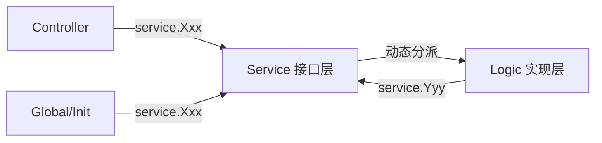
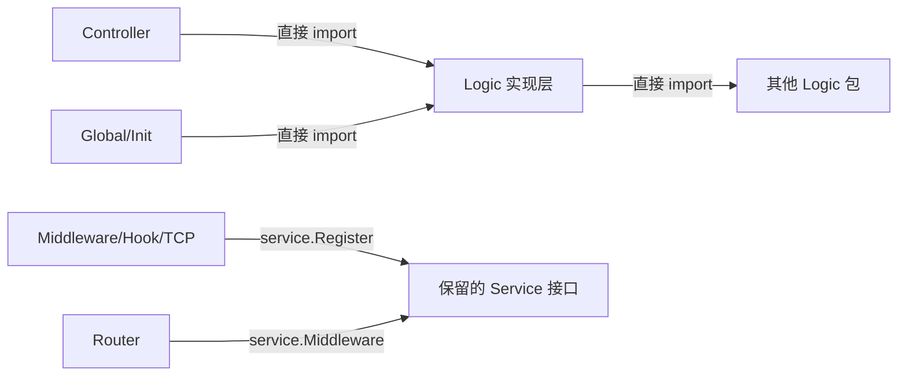

## 用户需求

简化 HotGo 项目的 service 层，去掉不必要的接口抽象。

## 产品概述

当前项目使用 GoFrame 的 `gf gen service` 自动生成 service 层（43 个接口、~358 个方法），作为 controller 和 logic 之间的中间层。但对于绝大多数 CRUD 场景，这层接口抽象增加了开发成本（每次改动都要重新生成）和代码冗余（每个接口都有 Register/Get 样板代码），没有实际解耦价值。

## 核心功能

1. **去掉 CRUD 类的 service 接口层**：删除 `admin.go`、`sys.go`、`pay.go`、`common.go` 四个 service 文件（共 37 个接口、~311 个方法），controller 和 logic 间互调改为直接包导入调用
2. **保留少量真正需要接口的 service**：`middleware.go`、`hook.go`、`tcpserver.go`、`tcpclient.go`、`view.go`（共 6 个接口、~47 个方法），因为它们涉及多态注册、路由中间件绑定等场景，接口抽象有实际价值
3. **改造 logic 层导出方式**：每个 logic 文件新增包级导出函数（如 `func AdminCash() *sAdminCash`），替代原有的 `service.RegisterXxx()` + `service.Xxx()` 调用链
4. **修改代码生成器模板**：让新生成的 CRUD 模块直接采用简化架构，不再生成 service 中间层代码
5. **更新构建流程**：移除 Makefile 中的 `make service` 目标，更新 `logic.go` 的 blank import

## 技术栈

- 后端框架：GoFrame v2 (Go)
- 前端：Vue3 + TypeScript（本次不涉及前端改动）
- 代码生成：HotGo 自带的 hggen 工具

## 实现方案

### 核心策略

采用"导出函数替代 service 注册"的方式，将 `service.Xxx().Method()` 调用改为 `logicPkg.Xxx().Method()`。这样改动最小——只需改 import 路径和包前缀，方法调用签名完全不变。

### 具体方案

**Logic 层导出方式改造：**

```
// 改造前 (logic/admin/cash.go)
func init() {
    service.RegisterAdminCash(NewAdminCash())
}

// 改造后
var insAdminCash = NewAdminCash()

func AdminCash() *sAdminCash {
    return insAdminCash
}
```

**Controller 调用方式改造：**

```
// 改造前 (controller/admin/admin/cash.go)
import "hotgo/internal/service"
service.AdminCash().View(ctx, ...)

// 改造后
import adminLogic "hotgo/internal/logic/admin"
adminLogic.AdminCash().View(ctx, ...)
```

由于 controller 包名与 logic 包名可能冲突（都叫 `admin`），统一使用 import 别名：`adminLogic`、`sysLogic`、`payLogic`、`commonLogic`。

**Logic 间互调改造：**

经验证，跨包调用关系为单向：admin→sys、pay→sys、common→sys，不存在循环依赖，可以安全地直接包导入。同包内的调用（如 admin/cash.go 调 admin/member.go）可直接调用同包函数。

### 关键技术决策

1. **导出函数而非导出变量**：使用 `func AdminCash() *sAdminCash` 而非 `var AdminCash = sAdminCash{}`。函数形式更安全（延迟初始化、可控返回），且调用方式与原有 `service.AdminCash()` 完全一致，改造成本最低。

2. **有状态的 logic 使用包级单例**：如 `sAdminMember` 含 `superAdmin` 状态字段，使用 `var insAdminMember = NewAdminMember()` 保持单例。无状态的也用单例保持一致性。

3. **保留 5 个 service 文件改为手动维护**：移除文件头的"DO NOT EDIT"注释，不再由 `gf gen service` 生成。

4. **循环依赖安全性**：经分析所有 logic 间跨包调用关系，确认无循环依赖：

- `logic/admin` → `logic/sys` (单向，如 cash.go 调 SysConfig)
- `logic/pay` → `logic/sys` (单向)
- `logic/common` → `logic/sys` (单向)
- `logic/middleware` 保留 service 模式，不参与直接调用

## 实现备注

### 性能

此改造消除了 service 层的接口间接调用，理论上有微小的性能提升（减少接口方法的动态分派），但实际差异可忽略。主要收益在于减少代码量和维护复杂度。

### 向后兼容

- 插件(addons)系统有自己独立的 service 层（如 `addons/hgexample/service/`），本次不改动，插件仍使用 `gf gen service` 模式。后续可按需改造。
- 路由注册中 `service.Middleware().AdminAuth` 等引用保持不变。

### 风险控制

- 改造后所有 service 的 nil panic 检查自然消除（不再有动态注册）
- `logic.go` 中只保留仍需 init() 注册的 5 个包的 blank import
- Makefile 中 `make service` 目标更新为仅处理保留的包，或移除

## 架构设计

### 改造前调用链



### 改造后调用链



## 目录结构

```
server/internal/service/
├── middleware.go     # [KEEP] 手动维护，移除 "DO NOT EDIT" 注释。IMiddleware 接口 + Register/Get 函数
├── hook.go           # [KEEP] 手动维护。IHook 接口
├── tcpserver.go      # [KEEP] 手动维护。ITCPServer 接口
├── tcpclient.go      # [KEEP] 手动维护。IAuthClient + ICronClient 接口
├── view.go           # [KEEP] 手动维护。IView 接口
├── admin.go          # [DELETE] 37个接口全部删除
├── sys.go            # [DELETE] 21个接口全部删除
├── pay.go            # [DELETE] 2个接口全部删除
└── common.go         # [DELETE] 2个接口全部删除

server/internal/logic/
├── logic.go                    # [MODIFY] 移除 admin/sys/pay/common 的 blank import，仅保留 middleware/hook/tcpserver/tcpclient/view
├── admin/
│   ├── cash.go                 # [MODIFY] 移除 init()+service.Register，新增 insAdminCash 单例 + AdminCash() 导出函数；互调 service.AdminMember() → AdminMember()（同包）；service.SysConfig() → sysLogic.SysConfig()
│   ├── credits_log.go          # [MODIFY] 同上模式
│   ├── dept.go                 # [MODIFY] 同上模式
│   ├── member.go               # [MODIFY] 同上模式（有状态单例）
│   ├── member_post.go          # [MODIFY] 同上模式
│   ├── menu.go                 # [MODIFY] 同上模式
│   ├── monitor.go              # [MODIFY] 同上模式
│   ├── notice.go               # [MODIFY] 同上模式
│   ├── order.go                # [MODIFY] 同上模式
│   ├── post.go                 # [MODIFY] 同上模式
│   ├── role.go                 # [MODIFY] 同上模式
│   └── site.go                 # [MODIFY] 同上模式
├── sys/
│   ├── config.go               # [MODIFY] 同上模式（内部互调改同包直接调用）
│   ├── addons.go ... (21个文件) # [MODIFY] 同上模式
├── pay/
│   ├── create.go ... (5个文件)  # [MODIFY] 同上模式
├── common/
│   ├── upload.go               # [MODIFY] 同上模式
│   └── wechat.go               # [MODIFY] 同上模式

server/internal/controller/
├── admin/admin/
│   ├── cash.go                 # [MODIFY] import 从 service 改为 adminLogic "hotgo/internal/logic/admin"，调用从 service.AdminCash() 改为 adminLogic.AdminCash()
│   └── ... (10个文件)           # [MODIFY] 同上模式
├── admin/sys/
│   ├── config.go               # [MODIFY] import 改为 sysLogic，调用改为 sysLogic.SysXxx()
│   └── ... (20个文件)           # [MODIFY] 同上模式
├── admin/pay/
│   └── refund.go               # [MODIFY] import 改为 payLogic
├── admin/common/
│   ├── upload.go               # [MODIFY] import 改为 commonLogic
│   └── ... (5个文件)            # [MODIFY] 同上模式
├── home/base/site.go           # [MODIFY] 调整 service 引用
├── api/pay/                    # [MODIFY] 调整 service 引用
└── websocket/handler/          # [MODIFY] 调整 service 引用

server/internal/global/
├── init.go                     # [MODIFY] service.SysConfig() → sysLogic.SysConfig()，service.AdminMember() → adminLogic.AdminMember()
└── cluster.go                  # [MODIFY] 同上模式

server/resource/generate/default/curd/
├── controller.go.template      # [MODIFY] service.@{.servFunName}() 改为 @{.templateGroup}Logic.@{.servFunName}()，import 改为 logic 包
├── logic.go.template           # [MODIFY] 移除 init()+service.Register，新增包级单例 + 导出函数
└── router.go.template          # [KEEP] 无需改动

server/internal/library/hggen/views/
└── curd.go                     # [MODIFY] importService 变量改为 importLogic，指向 logic 包路径

server/Makefile                 # [MODIFY] 移除或更新 make service 目标
```