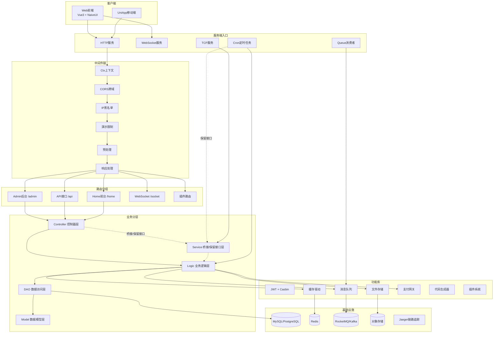
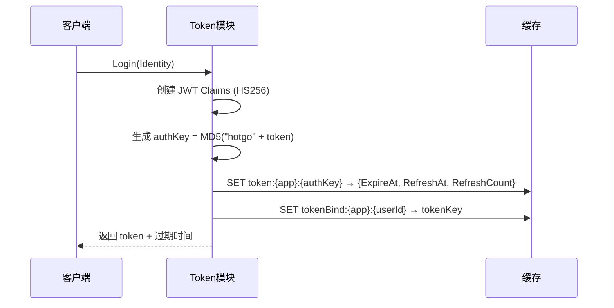
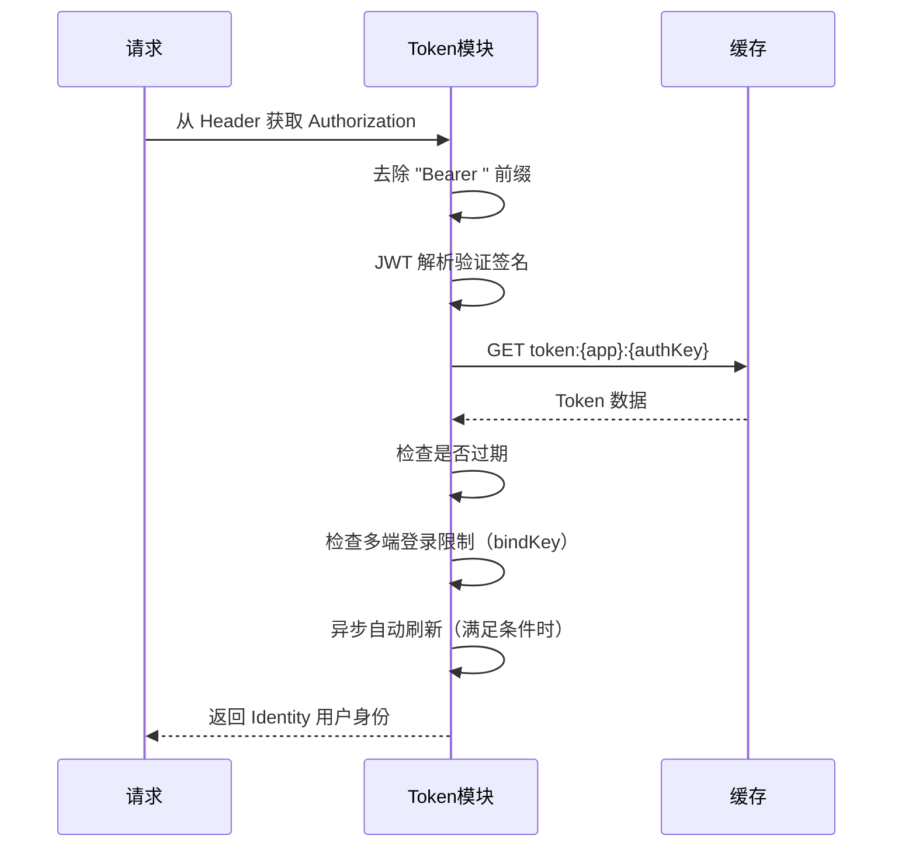
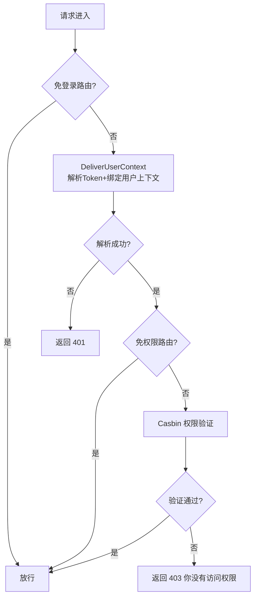
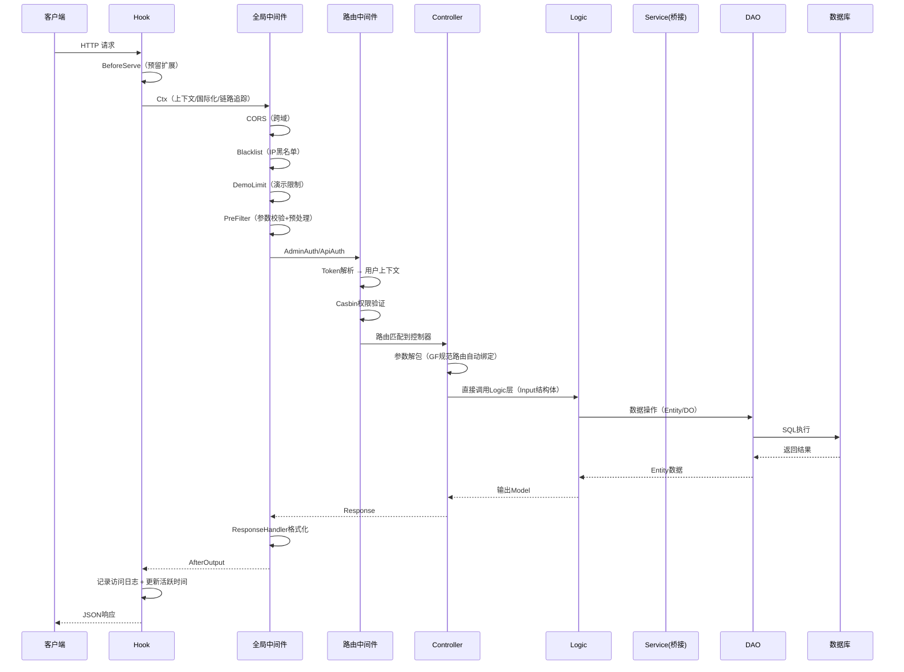
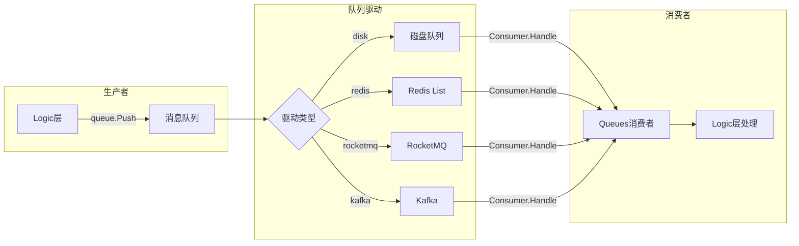
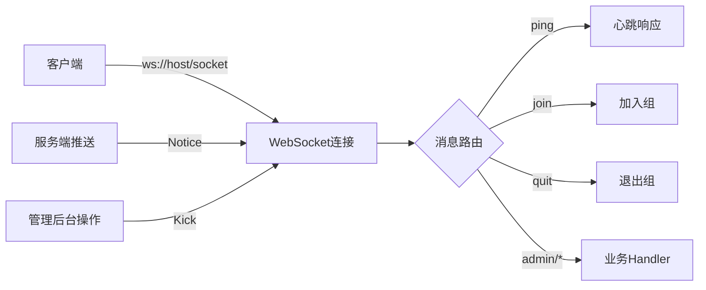
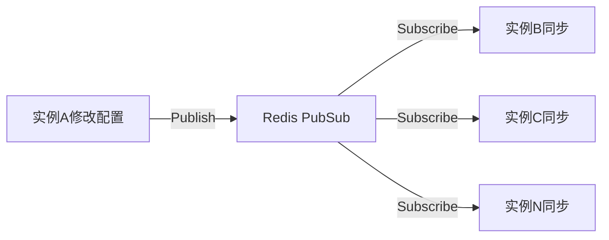

# 技术架构解析

> 本文档深入解析 HotGo 的系统架构设计，包括多服务命令体系、启动流程、中间件链、路由分组、鉴权流程和数据流向。
>
> **文档导航**：[← 返回主文档](dev-guide.md) | [服务端模块 →](dev-server-modules.md) | [前端模块](dev-frontend-modules.md) | [接口定义](dev-api-interfaces.md) | [插件系统](dev-plugin-system.md) | [配置参考](dev-config-reference.md) | [部署指南](dev-deployment.md)

## 1. 系统架构总览



## 2. 分层架构

HotGo 采用经典的**五层分层架构**（v3.0 起 Controller 直接调用 Logic，Service 层仅保留桥接和多态接口）：

```
api (请求/响应结构体定义)
  → controller (参数解析、响应打包)
    → logic (业务逻辑实现，Controller 直接调用)
      → dao (数据访问) → model (数据模型)
    → service (仅桥接接口和保留接口，用于打破循环依赖和多态注册)
```

| 层级 | 目录 | 职责 | 关键特性 |
|------|------|------|----------|
| **API** | `server/api/` | 定义请求/响应结构体 | GoFrame 规范路由的输入输出 |
| **Controller** | `server/internal/controller/` | 解包请求参数，调用 Logic，打包响应 | 不含任何业务逻辑；直接调用 Logic 层 |
| **Service** | `server/internal/service/` | 桥接接口（打破循环依赖）+ 保留接口（Middleware/Hook/TCP/View） | Register/Get 全局访问模式；不再使用 `gf gen service` |
| **Logic** | `server/internal/logic/` | 业务逻辑实现 | 单例导出模式；需桥接的通过 `init()` 注册到 Service |
| **DAO** | `server/internal/dao/` | 数据访问操作 | 外层可扩展 + 内层自动生成 |
| **Model** | `server/internal/model/` | 实体/操作/输入模型 | entity(表映射) + do(操作) + input(业务) |

## 3. 启动流程

### 3.1 入口 `main.go`

```go
func main() {
    var ctx = gctx.GetInitCtx()
    global.Init(ctx)     // 全局初始化
    cmd.Main.Run(ctx)    // 执行命令
}
```

**隐式初始化（通过匿名导入 `_`）：**

| 导入包 | 作用 |
|--------|------|
| `hotgo/internal/packed` | 打包的静态资源 |
| `github.com/gogf/gf/contrib/drivers/mysql/v2` | MySQL 驱动注册 |
| `github.com/gogf/gf/contrib/drivers/pgsql/v2` | PostgreSQL 驱动注册 |
| `github.com/gogf/gf/contrib/nosql/redis/v2` | Redis 驱动注册 |
| `hotgo/addons/modules` | 插件模块注册 |
| `hotgo/internal/logic` | 所有业务逻辑的 init() 注册 |

### 3.2 全局初始化 `global.Init(ctx)`

> 文件：`server/internal/global/init.go`

按以下顺序执行：

| 步骤 | 函数 | 说明 |
|------|------|------|
| 1 | `SetGFMode(ctx)` | 从 `system.mode` 读取运行模式（develop/testing/staging/product） |
| 2 | `glog.SetDefaultHandler(LoggingServeLogHandler)` | 设置全局日志处理器，WARN/ERRO/FATA/PANI 级别自动写入服务日志表 |
| 3 | `gtime.SetTimeZone("Asia/Shanghai")` | 设置默认时区 |
| 4 | `InitTrace(ctx)` | 当 `jaeger.switch=true` 时初始化 Jaeger 链路追踪 |
| 5 | `cache.SetAdapter(ctx)` | 根据 `cache.adapter` 配置选择缓存驱动（memory/redis/file） |
| 6 | `service.SysConfig().InitConfig(ctx)` | 从数据库加载系统功能配置到内存（通过桥接接口） |
| 7 | `service.AdminMember().LoadSuperAdmin(ctx)` | 预加载超级管理员数据到内存（通过桥接接口） |
| 8 | `SubscribeClusterSync(ctx)` | 集群模式下订阅 Redis PubSub 同步（配置/黑名单/超管数据） |

### 3.3 集群同步机制

> 文件：`server/internal/global/cluster.go`

集群部署时（`system.isCluster=true`），通过 Redis PubSub 实现多实例间数据同步：

| 订阅主题 | 同步内容 |
|----------|----------|
| `ClusterSyncSysconfig` | 系统配置变更 |
| `ClusterSyncSysBlacklist` | IP 黑名单变更 |
| `ClusterSyncSysSuperAdmin` | 超管数据变更 |

## 4. 多服务命令体系

### 4.1 命令注册

> 文件：`server/internal/cmd/cmd.go`

```go
func init() {
    Main.AddCommand(All, Http, Queue, Cron, Auth, Tools, Up, Help)
}
```

| 命令 | 启动方式 | 说明 |
|------|----------|------|
| `all`（默认） | `go run main.go` | 同时启动 HTTP + Queue + Cron |
| `http` | `go run main.go http` | HTTP/WebSocket/TCP 服务 |
| `queue` | `go run main.go queue` | 消息队列消费者 |
| `cron` | `go run main.go cron` | 定时任务 |
| `auth` | `go run main.go auth` | 授权客户端服务 |
| `tools` | `go run main.go tools -m=casbin -a1=refresh` | 命令行工具（Casbin/Gres） |
| `up` | `go run main.go up` | 版本升级修复 |
| `help` | `go run main.go help` | 查看帮助 |

### 4.2 All 命令 — 启动全部服务

```go
All.Func = func(ctx context.Context, parser *gcmd.Parser) (err error) {
    var allServers = []*gcmd.Command{Http, Queue, Cron}
    for _, server := range allServers {
        simple.SafeGo(ctx, func(ctx context.Context) {
            cmd.Func(ctx, parser)         // 每个服务在独立 goroutine 中启动
        })
    }
    signalListen(ctx, signalHandlerForOverall)  // 监听系统信号
    <-serverCloseSignal                          // 等待关闭信号
    serverWg.Wait()                              // 等待所有服务优雅关闭
}
```

### 4.3 HTTP 服务启动流程

> 文件：`server/internal/cmd/http.go`

```
① s := g.Server()                                   // 获取 HTTP Server 实例
② 绑定 Hook: BeforeServe + AfterOutput               // 请求前/响应后钩子
③ 注册全局中间件链（6个中间件）                         // Ctx → CORS → Blacklist → DemoLimit → PreFilter → ResponseHandler
④ 注册路由组                                          // Admin / Api / WebSocket / Home
⑤ addons.StartModules(ctx)                           // 启动插件模块
⑥ casbin.InitEnforcer(ctx)                           // 初始化 Casbin 权限引擎
⑦ hggen.InIt(ctx)                                    // 初始化代码生成配置（非 product 模式）
⑧ service.TCPServer().Start(ctx)                     // 启动 TCP 服务器（保留接口）
⑨ adminLogic.AdminMonitor().StartMonitor(ctx)        // 启动服务监控（直接调用 Logic）
⑩ sysLogic.SysBlacklist().Load(ctx)                  // 加载 IP 黑名单（直接调用 Logic）
⑪ payLogic.Pay().RegisterNotifyCall()                // 注册支付成功回调（直接调用 Logic）
⑫ s.Run()                                            // 启动 HTTP 服务
```

**HTTP 关闭序列（收到系统信号后）：**

```
websocket.Stop()              // 关闭 WebSocket
service.TCPServer().Stop(ctx) // 关闭 TCP 服务
addons.StopModules(ctx)       // 停止插件
s.Shutdown()                  // 关闭 HTTP 服务（最后关闭）
```

### 4.4 Queue 消息队列服务

> 文件：`server/internal/cmd/queue.go`

```go
Queue.Func = func(ctx context.Context, parser *gcmd.Parser) (err error) {
    queue.Logger().SetHandlers(global.LoggingServeLogHandler)
    simple.SafeGo(ctx, func(ctx context.Context) {
        queue.StartConsumersListener(ctx)   // 启动消费者监听
    })
    // ...等待关闭信号
}
```

- 消费者通过 `_ "hotgo/internal/queues"` 隐式注册
- 支持驱动：`disk` / `redis` / `rocketmq` / `kafka`

### 4.5 Cron 定时任务服务

> 文件：`server/internal/cmd/cron.go`

```go
Cron.Func = func(ctx context.Context, parser *gcmd.Parser) (err error) {
    cron.Logger().SetHandlers(global.LoggingServeLogHandler)
    sysLogic.SysCron().StartCron(ctx)    // 启动定时任务（直接调用 Logic）
    service.CronClient().Start(ctx)      // 启动 TCP 客户端（保留接口）
    // ...关闭时: service.CronClient().Stop(ctx) + cron.StopALL()
}
```

- 定时任务通过 `_ "hotgo/internal/crons"` 隐式注册
- TCP 客户端用于动态调整任务（HTTP 管理后台可实时控制）

### 4.6 信号处理与优雅关闭

> 文件：`server/internal/cmd/handler_shutdown.go`

```go
var (
    serverCloseSignal = make(chan struct{}, 1)   // 关闭信号通道
    serverWg          = sync.WaitGroup{}         // 服务等待组
    once              sync.Once                  // 确保关闭事件只执行一次
)

func serverCloseEvent(ctx context.Context) {
    once.Do(func() {
        simple.Event().Call(consts.EventServerClose, ctx)  // 执行所有注册的关闭回调
    })
}
```

## 5. 中间件链

### 5.1 全局中间件（所有请求经过）

在 `cmd/http.go` 中注册到 `/*any`，按顺序执行：

```
请求 → Ctx → CORS → Blacklist → DemoLimit → PreFilter → ResponseHandler → 路由处理 → ResponseHandler(后处理)
```

### 5.2 各中间件详解

> 完整的中间件接口定义参见 [关键接口定义 — IMiddleware](dev-api-interfaces.md#1-中间件接口-imiddleware)

#### ① Ctx — 上下文初始化

> 文件：`server/internal/logic/middleware/init.go`

**必须第一个加载**，后续中间件依赖上下文数据。

| 步骤 | 操作 |
|------|------|
| 1 | 设置国际化语言（从 Header 的 `Locale` 字段读取） |
| 2 | 链路追踪（Jaeger 开启时创建 Span） |
| 3 | 记录请求 Body（上传路径除外） |
| 4 | 初始化 `model.Context` 到请求上下文（含模块名解析） |
| 5 | 设置 SessionId |
| 6 | 设置 NeverDoneCtx（防止请求上下文提前取消） |

**上下文模型：**

```go
type Context struct {
    Module    string    // 应用模块：admin | api | home | websocket
    AddonName string    // 插件名称
    User      *Identity // 用户身份信息
    Response  *Response // 请求响应数据
    Data      g.Map     // 自定义 KV 变量
}
```

#### ② CORS — 跨域处理

```go
func (s *sMiddleware) CORS(r *ghttp.Request) {
    r.Response.CORSDefault()   // 使用 GoFrame 默认 CORS 配置
    r.Middleware.Next()
}
```

#### ③ Blacklist — IP 黑名单

> 文件：`server/internal/logic/middleware/limit_blacklist.go`

命中黑名单时直接拒绝请求并返回错误码。黑名单数据在 HTTP 服务启动时通过 `sysLogic.SysBlacklist().Load(ctx)` 加载到内存。

#### ④ DemoLimit — 演示模式限制

> 文件：`server/internal/logic/middleware/init.go`

当 `system.isDemo=true` 时，**禁止所有 POST 请求**（白名单除外）：

| 白名单路由 | 说明 |
|-----------|------|
| `/admin/site/accountLogin` | 账号登录 |
| `/admin/site/mobileLogin` | 手机号登录 |
| `/admin/genCodes/preview` | 预览代码 |

#### ⑤ PreFilter — 请求输入预处理

> 文件：`server/internal/logic/middleware/pre_filter.go`

| 步骤 | 操作 |
|------|------|
| 1 | 获取当前路由的处理函数信息 |
| 2 | 仅处理 GoFrame 规范路由（输入参数为 2 个） |
| 3 | 反射创建输入对象，执行基本校验（`r.Parse`） |
| 4 | 如果实现了 `validate.Filter` 接口，执行预处理过滤 |
| 5 | 将过滤后的参数回写到请求 |

#### ⑥ ResponseHandler — HTTP 响应处理

> 文件：`server/internal/logic/middleware/response.go`

先执行业务逻辑（`r.Middleware.Next()`），然后处理响应：

| 步骤 | 操作 |
|------|------|
| 1 | 错误状态码接管（403/404 自定义提示） |
| 2 | 根据 Content-Type 选择格式：JSON（默认）/ HTML / XML |
| 3 | 解析错误码：CodeOK(0)="操作成功"，CodeNil(-1)=安全可控错误，其他=不可控错误 |
| 4 | Debug 模式输出堆栈，生产模式输出友好消息 |

**统一 JSON 响应格式：**

```json
{
    "code": 0,
    "message": "操作成功",
    "data": { ... }
}
```

### 5.3 路由级中间件

| 中间件 | 使用场景 | 说明 |
|--------|----------|------|
| **AdminAuth** | `/admin` 需登录路由 | Token 解析 → 用户上下文绑定 → Casbin 权限验证 |
| **ApiAuth** | `/api` 需登录路由 | Token 解析 → 用户上下文绑定（暂无权限验证，预留扩展） |
| **WebSocketAuth** | `/socket` 需登录路由 | Token 解析 → 用户上下文绑定 |
| **HomeAuth** | `/home` 路由 | 预留鉴权扩展点 |
| **Develop** | 代码生成/插件管理路由 | IP 白名单验证（`hggen.allowedIPs` 配置） |
| **Addon** | 插件路由 | 解析 URL 中的插件名，设置到上下文 |

### 5.4 HTTP Hook 钩子

> 文件：`server/internal/logic/hook/init.go`

| Hook | 时机 | 操作 |
|------|------|------|
| `BeforeServe` | 请求处理前 | 预留扩展（当前为空） |
| `AfterOutput` | 响应输出后 | 记录访问日志 + 更新管理员最后活跃时间 |

## 6. 路由体系

### 6.1 路由组总览

```go
s.Group("/", func(group *ghttp.RouterGroup) {
    router.Admin(ctx, group)      // /admin/*
    router.Api(ctx, group)        // /api/*
    router.WebSocket(ctx, group)  // /socket/*
    router.Home(ctx, group)       // / 和 /home/*
})
```

### 6.2 Admin 后台路由

> 文件：`server/internal/router/admin.go`

```
/login → 重定向到 /admin

/admin (前缀可配置)
├── [免登录] common.Site           → 登录/注册/验证码/配置
│
├── [AdminAuth 中间件]              → 需要登录 + 权限验证
│   ├── common: Console, Ems, Sms, Upload, Wechat
│   ├── sys: Config, DictType, DictData, Attachment, Provinces
│   │        Cron, CronGroup, Blacklist, Log, LoginLog
│   │        ServeLog, SmsLog, ServeLicense
│   ├── admin: Member, Monitor, Role, Dept, Menu
│   │          Notice, Post, Order, CreditsLog, Cash
│   └── pay: Refund
│
├── [Develop 中间件]                → 需要 IP 白名单
│   ├── sys.GenCodes               → 代码生成工具
│   └── sys.Addons                 → 插件管理
│
└── genrouter.Register(ctx, group) → 代码生成的动态路由
    ├── [免登录] NoLoginRouter
    └── [AdminAuth] LoginRequiredRouter (CurdDemo, TreeDemo 等)
```

**免登录路由**（配置 `router.admin.exceptLogin`）：
- `/sms/send` — 短信验证码
- `/wechat/authorizeCall` — 微信授权回调

**免权限路由**（配置 `router.admin.exceptAuth`）：
- `/member/info`、`/role/dynamic`、`/notice/pullMessages`、`/notice/readAll`、`/notice/upRead`
- `/dictData/option`、`/dictData/options`、`/provinces/select`、`/provinces/cityLabel`
- `/member/option`

### 6.3 API 前台路由

> 文件：`server/internal/router/api.go`

```
/api (前缀可配置)
├── [免登录] pay.NewV1()           → 支付异步通知回调
└── [ApiAuth 中间件]
    └── member.NewV1()             → 用户接口
```

### 6.4 WebSocket 路由

> 文件：`server/internal/router/websocket.go`

```
/socket (前缀可配置)
├── [免登录] controller.Send       → HTTP 发送 WS 消息（测试用）
└── [WebSocketAuth 中间件]
    └── GET /                      → WebSocket 连接端点

消息路由：
├── "ping"                         → 心跳
├── "join"                         → 加入组
├── "quit"                         → 退出组
├── "admin/monitor/trends"         → 后台监控动态数据
└── "admin/monitor/runInfo"        → 后台监控运行信息
```

### 6.5 Home 前台路由

> 文件：`server/internal/router/home.go`

```
/ [HomeAuth 中间件]
├── base.Site                      → 首页
└── /home (前缀可配置)
    └── base.Site                  → 首页
```

## 7. 鉴权流程

### 7.1 JWT Token 认证

> 文件：`server/internal/library/token/token.go`  
> Token 接口定义参见 [关键接口定义 — Token 认证](dev-api-interfaces.md#8-token-认证接口)  
> Token 配置参数参见 [配置参考 — JWT 令牌](dev-config-reference.md#7-token--jwt-令牌配置)

**Token 配置模型：**

| 参数 | 类型 | 说明 |
|------|------|------|
| `SecretKey` | string | JWT 加密密钥 |
| `Expires` | int64 | 有效期（秒），默认 604800（7 天） |
| `AutoRefresh` | bool | 自动刷新开关 |
| `RefreshInterval` | int64 | 刷新间隔（秒），默认 86400（1 天） |
| `MaxRefreshTimes` | int64 | 最大刷新次数，-1 不限制，默认 30 |
| `MultiLogin` | bool | 是否允许多端登录 |

**登录流程 `token.Login()`：**



**Token 解析流程 `token.ParseLoginUser()`：**



### 7.2 AdminAuth 鉴权流程

> 文件：`server/internal/logic/middleware/admin_auth.go`



### 7.3 Casbin RBAC 权限

> 文件：`server/internal/library/casbin/`

**初始化流程 `casbin.InitEnforcer(ctx)`：**

1. 获取数据库连接（支持读写分离，取 master）
2. 创建 Casbin 数据库适配器（基于 `hg_admin_role_casbin` 表）
3. 加载 `casbin.conf` 策略模型文件
4. 创建 Casbin Enforcer 实例
5. 联表查询加载权限策略：
   - `AdminRole` JOIN `AdminRoleMenu` JOIN `AdminMenu`
   - 条件：角色启用、菜单启用、有权限标识、非超管角色
   - 生成规则：`[roleKey, permissions, "GET|POST|PUT|DELETE|PATCH|OPTIONS|HEAD"]`

**权限验证：**

```go
casbin.Enforcer.Enforce(roleKey, path, method)
```

**注意：** 超级管理员（`SuperRoleKey`）不加载到 Casbin，验证时直接放行。

## 8. 数据流向

### 8.1 HTTP 请求完整生命周期



### 8.2 消息队列数据流



### 8.3 WebSocket 数据流



### 8.4 集群同步数据流



## 9. 上下文模型

> 文件：`server/internal/model/context.go`

```go
type Context struct {
    Module    string    // 应用模块：admin | api | home | websocket
    AddonName string    // 插件名称
    User      *Identity // 用户身份信息
    Response  *Response // 请求响应数据
    Data      g.Map     // 自定义 KV 变量
}

type Identity struct {
    Id       int64       // 用户ID
    Pid      int64       // 上级ID
    DeptId   int64       // 部门ID
    DeptType string      // 部门类型
    RoleId   int64       // 角色ID
    RoleKey  string      // 角色唯一标识符
    Username string      // 用户名
    RealName string      // 姓名
    Avatar   string      // 头像
    Email    string      // 邮箱
    Mobile   string      // 手机号码
    App      string      // 登录应用
    LoginAt  *gtime.Time // 登录时间
}
```

**contexts 包主要工具函数：**

| 函数 | 说明 |
|------|------|
| `Init(r, customCtx)` | 初始化上下文到请求 |
| `Get(ctx)` | 获取 `*model.Context` |
| `SetUser/GetUser/GetUserId/GetRoleId/GetRoleKey` | 用户信息读写 |
| `SetModule/GetModule` | 模块信息读写 |
| `SetAddonName/GetAddonName/IsAddonRequest` | 插件信息读写 |
| `GetDeptType/IsCompanyDept/IsTenantDept/IsMerchantDept` | 部门类型判断 |
| `Detach(ctx)` | 创建脱离原 context 生命周期的 detached context |

---

*本文档基于 HotGo v2.18.6 代码库分析生成。*
