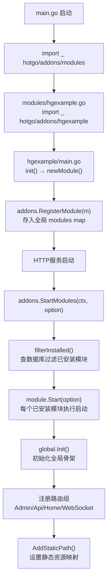

# 插件系统完整指南

> 本文档详解 HotGo 的微核插件架构设计、接口定义、开发流程和示例分析。
>
> **文档导航**：[← 返回主文档](dev-guide.md) | [技术架构](dev-architecture.md) | [服务端模块](dev-server-modules.md) | [前端模块](dev-frontend-modules.md) | [接口定义](dev-api-interfaces.md) | [配置参考 →](dev-config-reference.md) | [部署指南](dev-deployment.md)

## 1. 架构设计

HotGo 采用**微核架构**设计插件系统，核心思想是：

- **功能隔离**：每个插件拥有独立的 API/Controller/Logic/Model/Router/Crons/Queues/Global
- **自动注册**：利用 Go 的 `init()` + `import _` 机制实现零配置注册
- **状态持久化**：安装状态存储在数据库 `sys_addons_install` 表中
- **生命周期管理**：支持安装、启动、停止、升级、卸载完整生命周期
- **代码生成**：支持一键从模板创建新插件

## 2. 核心接口

### 2.1 Module 接口

所有插件必须实现此接口：

```go
type Module interface {
    Start(option *Option) (err error)          // 启动模块
    Stop() (err error)                         // 停止模块
    Ctx() context.Context                      // 获取上下文
    GetSkeleton() *Skeleton                    // 获取骨架信息
    Install(ctx context.Context) (err error)   // 安装回调
    Upgrade(ctx context.Context) (err error)   // 升级回调
    UnInstall(ctx context.Context) (err error) // 卸载回调
}
```

### 2.2 Skeleton 骨架结构

```go
type Skeleton struct {
    Label       string // 显示名称
    Name        string // 唯一标识（小写英文，用于路径和包名）
    Group       int    // 分组
    Logo        string // Logo 图标
    Brief       string // 简介
    Description string // 详细描述
    Author      string // 作者
    Version     string // 版本号
    RootPath    string // 根路径（自动设置，无需手动填写）
}
```

### 2.3 Option 启动选项

```go
type Option struct {
    Ctx   context.Context
    Group *ghttp.RouterGroup  // HTTP 路由组
}
```

## 3. 插件目录结构规范

每个插件必须遵循以下目录结构：

```
addons/{name}/
├── main.go                      # 入口文件，实现 Module 接口
├── api/                         # API 请求/响应结构体
│   ├── admin/{module}/          # 后台 API
│   ├── api/{module}/            # 前台 API
│   ├── home/{module}/           # 前台页面 API
│   └── websocket/{module}/      # WebSocket API
├── controller/                  # 控制器层
│   ├── admin/sys/               # 后台控制器
│   ├── api/                     # 前台控制器
│   ├── home/                    # 前台页面控制器
│   └── websocket/               # WebSocket 控制器
├── crons/                       # 定时任务
├── global/                      # 全局变量和初始化
│   ├── global.go                # 骨架变量声明
│   └── init.go                  # 初始化函数
├── logic/                       # 业务逻辑层
├── model/                       # 数据模型
│   └── input/sysin/             # 输入/输出模型
├── queues/                      # 消息队列消费者
├── router/                      # 路由定义
│   ├── admin.go                 # 后台路由（带鉴权）
│   ├── api.go                   # 前台 API 路由
│   ├── home.go                  # 前台页面路由
│   ├── websocket.go             # WebSocket 路由
│   └── genrouter/               # 代码生成的路由
└── service/                     # 服务接口层
```

## 4. 启动加载流程



## 5. 路径约定

| 类型 | 路径规则 | 示例 |
|------|----------|------|
| 模块代码 | `./addons/{name}` | `./addons/hgexample` |
| 模板路径 | `resource/addons/{name}/template` | `resource/addons/hgexample/template` |
| 静态资源 | `resource/addons/{name}/public` | `resource/addons/hgexample/public` |
| 静态 URL | `/addons/{name}` | `/addons/hgexample` |
| Admin 路由 | `/admin/{name}/...` | `/admin/hgexample/...` |
| API 路由 | `/api/{name}/...` | `/api/hgexample/...` |
| Home 路由 | `/home/{name}/...` | `/home/hgexample/...` |
| WS 路由 | `/socket/{name}/...` | `/socket/hgexample/...` |

## 6. 开发一个新插件

### 6.1 方式一：代码生成（推荐）

通过后台管理界面或 API 一键生成插件模板：

```go
addons.Build(ctx, &addons.BuildOption{
    Config: &addons.BuildConfig{
        SrcPath:     "模板源路径",
        DstPath:     "目标路径",
        Name:        "myplugin",
        Label:       "我的插件",
        Version:     "v1.0.0",
        Description: "插件描述",
        Author:      "作者名",
    },
})
```

生成后会自动创建：
- Go 插件代码目录结构
- `addons/modules/{name}.go` 注册文件
- WebApi TS 文件
- Vue 配置页面模板

### 6.2 方式二：手动创建

**步骤 1：创建入口文件** `addons/myplugin/main.go`

```go
package myplugin

import (
    "context"
    "hotgo/addons/myplugin/global"
    "hotgo/addons/myplugin/router"
    "hotgo/internal/library/addons"
    "hotgo/internal/service"
)

type module struct {
    skeleton *addons.Skeleton
    ctx      context.Context
}

func init() { newModule() }

func newModule() {
    m := &module{
        skeleton: &addons.Skeleton{
            Label:   "我的插件",
            Name:    "myplugin",
            Group:   1,
            Brief:   "插件简介",
            Author:  "作者",
            Version: "v1.0.0",
        },
        ctx: gctx.New(),
    }
    addons.RegisterModule(m)
}

func (m *module) Start(option *addons.Option) (err error) {
    global.Init(m.ctx, m.skeleton)
    option.Group.Group("/", func(group *ghttp.RouterGroup) {
        group.Middleware(service.Middleware().Addon)
        router.Admin(m.ctx, group)
        router.Api(m.ctx, group)
        router.Home(m.ctx, group)
    })
    return
}

func (m *module) Stop() (err error)                         { return }
func (m *module) Ctx() context.Context                      { return m.ctx }
func (m *module) GetSkeleton() *addons.Skeleton             { return m.skeleton }
func (m *module) Install(ctx context.Context) (err error)   { return }
func (m *module) Upgrade(ctx context.Context) (err error)   { return }
func (m *module) UnInstall(ctx context.Context) (err error) { return }
```

**步骤 2：创建注册文件** `addons/modules/myplugin.go`

```go
package modules

import _ "hotgo/addons/myplugin"
```

**步骤 3：在后台安装**

插件注册后，通过管理后台 → 插件管理 → 安装，即可激活插件。

## 7. 与主系统的交互

> Module 接口的完整方法说明参见 [关键接口定义 — Module](dev-api-interfaces.md#2-插件模块接口-module)  
> 插件路由如何与前端对接参见 [前端核心模块 — 路由系统](dev-frontend-modules.md#3-路由系统)

### 7.1 使用主系统服务

插件可通过主系统的桥接 Service 接口和保留接口进行调用：

```go
// 获取当前用户信息
user := contexts.GetUser(ctx)

// 调用系统配置（通过桥接接口）
config, _ := service.SysConfig().GetBasic(ctx)

// 使用字典服务（直接调用 Logic 层，如果无循环依赖）
// 或通过 isc "hotgo/internal/service" 调用桥接接口
data, _ := sysLogic.SysDictData().Select(ctx, "dict_type")
```

### 7.2 路由中间件

插件路由注册时，可使用主系统的全部中间件：

```go
// 免登录路由
group.Bind(controller.Index)

// 需要登录的路由
group.Group("/", func(group *ghttp.RouterGroup) {
    group.Middleware(service.Middleware().AdminAuth)
    group.Bind(controller.Table, controller.Config)
})

// 开发工具路由（IP白名单）
group.Group("/", func(group *ghttp.RouterGroup) {
    group.Middleware(service.Middleware().Develop)
    group.Bind(controller.GenCodes)
})
```

### 7.3 Addon 中间件

`Middleware().Addon` 中间件会从 URL 路径中解析插件名称，并设置到请求上下文中：

```go
// 在插件代码中获取当前插件名
addonName := contexts.GetAddonName(ctx)
isAddon := contexts.IsAddonRequest(ctx)
```

## 8. 示例插件分析 — hgexample

### 8.1 基本信息

| 属性 | 值 |
|------|------|
| 名称 | hgexample |
| 显示名 | 功能案例 |
| 版本 | v1.0.0 |
| 作者 | 孟帅 |
| 文件数 | 78 |

### 8.2 功能模块

| 模块 | 说明 |
|------|------|
| `config` | 插件配置管理 |
| `table` | 表格 CRUD 演示 |
| `treetable` | 树表演示 |
| `tenantorder` | 多租户订单示例 |
| `comp` | 导入演示 |
| `index` | 插件首页 |

### 8.3 路由注册

| 路由组 | 前缀 | 中间件 | 控制器 |
|--------|------|--------|--------|
| Admin（免登录） | `/admin/hgexample` | Addon | sys.Index |
| Admin（需登录） | `/admin/hgexample` | Addon + AdminAuth | sys.Comp, sys.Config, sys.Table, sys.TreeTable |
| API（免登录） | `/api/hgexample` | Addon | api.Index |
| Home | `/home/hgexample` | Addon | home.Index |
| WebSocket | `/socket/hgexample` | Addon | websocket.Index |

### 8.4 WebSocket 消息路由

```go
websocket.RegisterMsg("admin/addons/hgexample/testMessage", handler.Index.TestMessage)
```

## 9. 安装管理机制

### 9.1 数据库表 `sys_addons_install`

| 字段 | 说明 |
|------|------|
| name | 插件名称 |
| version | 已安装版本 |
| status | 安装状态 |
| created_at | 安装时间 |
| updated_at | 更新时间 |

### 9.2 安装/升级/卸载流程

```go
// 安装：事务中写入记录 + 调用模块 Install() 钩子
addons.Install(module)

// 升级：事务中更新版本号 + 调用模块 Upgrade() 钩子
addons.Upgrade(module)

// 卸载：事务中更新状态 + 调用模块 UnInstall() 钩子
addons.UnInstall(module)
```

---

